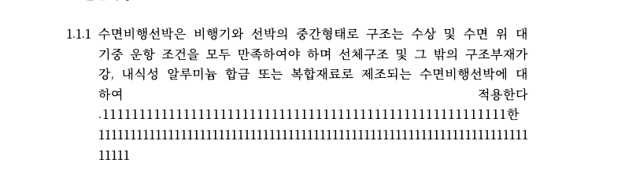

# PR #3944 검토 — 배분·셀 보정 간격과 browser glyph 폭 분리

## 검토 경로

```text
base route: collaborator_self_merge.md
modifiers: intake_and_review.md, local_validation.md,
           visual_fixture_evidence.md, multi_pr_update_branch.md
loaded documents: pr_review_workflow.md, pr_review/README.md,
                  collaborator_self_merge.md, intake_and_review.md,
                  local_validation.md, visual_fixture_evidence.md,
                  multi_pr_update_branch.md
current remote head: 99d25623812aab639ac36c1fc3cca5f66dadd4cf
                     (보정 push 전 작성 시점 참고값)
local correction commit: 1d5db120d
latest base: cf5d462dcda1b5ab71160033e1d454b42198ad18
```

## 메타데이터

| 항목 | 값 |
| --- | --- |
| PR | [#3944](https://github.com/edwardkim/rhwp/pull/3944) |
| 작성자 | `postmelee` (collaborator self-merge) |
| Stack | 1 / 3 |
| 대상 / head | `devel` / `stack/issue-3937-distribution-glyph-width` |
| 작성 시점 원격 상태 | draft, `MERGEABLE`; 보정 push 뒤 재확인 필요 |
| 보정 전 원격 head | `99d25623812aab639ac36c1fc3cca5f66dadd4cf` |
| 최신 동기화 기준 | `upstream/devel` `cf5d462dcda1b5ab71160033e1d454b42198ad18` |
| review correction | `1d5db120d` |
| review 문서 작성 전 PR 고유 규모 | 9 files, +444 / -119 |
| 관련 issue | [#3937](https://github.com/edwardkim/rhwp/issues/3937) |
| 다음 레이어 | [#3945](https://github.com/edwardkim/rhwp/pull/3945), [#3946](https://github.com/edwardkim/rhwp/pull/3946) |

draft, mergeability, head SHA와 CI는 변할 수 있는 작성 시점 참고값이다. 최종 merge 조건은 이 문서를
포함해 다시 push한 최신 PR head의 GitHub Actions 통과와 작업지시자 승인이다. 사용자 지시에 따라 ready
전환과 merge는 이 review commit에서 수행하지 않는다.

## 변경 범위와 목적

거대 표 셀과 배분 정렬 문단에서 영문·숫자 glyph 윤곽 자체가 가로로 늘어나는 renderer 오류를 수정한다.
기존 Canvas2D와 SVG는 다음 cluster의 origin을 옮기기 위한 `extra_char_spacing`까지 현재 glyph의
browser-fit 목표 폭에 포함했다. 그 결과 문자 사이 간격뿐 아니라 ASCII glyph 윤곽도 수평 확대됐다.

이 PR은 layout advance와 glyph-fit advance를 분리한다. 문자 origin·줄바꿈·pagination은 기존 layout
advance를 유지하고, Canvas `scaleX`와 SVG `textLength`에 쓰는 폭에서는 양수
`extra_char_spacing`만 제외한다. 이 계약은 배분·나눔 정렬뿐 아니라 대체 폰트 측정 폭이 셀보다 좁을
때의 양수 cell-underflow 보정에도 적용된다.

음수 `extra_char_spacing`은 일반적인 음수 배분 간격이 아니라 #2189의 표 셀 오버플로우 압축에서
사용되는 값이다. 이 경우에는 종전처럼 압축된 layout advance를 browser glyph-fit 목표로 유지한다.
Canvas2D/SVG의 기존 #2189 계약, 명시적 장평, 첨자 배율, ASCII pinning과 반각 CJK 인용부호
`textLength` 계약은 바꾸지 않는다.

## 리뷰 지적 대응

[리뷰 코멘트](https://github.com/edwardkim/rhwp/pull/3944#issuecomment-5177714677)를 검토하고 다음처럼
반영했다.

### 1. 음수 `extra_char_spacing`과 #2189 셀 압축 회귀

초안은 음수 값에서 `glyph_fit_advance()`가 `None`을 반환하게 해 Canvas 일반·ASCII fit과 SVG
`textLength`를 모두 끄고 있었다. 압축된 origin 위에 intrinsic 폭 glyph가 그려져 글자 겹침이나 셀
우변 클리핑이 재발할 수 있는 교차회귀였다.

보정 commit `1d5db120d`에서 양수 값만 glyph-fit advance에서 제외하고, 0 또는 음수 값은 기존 layout
advance를 그대로 목표로 사용하도록 범위를 좁혔다. 음수 Canvas 경로는 ASCII pinning 활성·비활성 모두
`5 / 8 = 0.625` fit을 유지한다. SVG 일반 ASCII와 반각 낫표도 음수 보정된 `textLength`를 유지한다.
`issue_2189_cell_text_clip` 표적 통합 테스트로 셀 압축 계약을 별도 확인했다.

### 2. 배분 정렬 밖의 cell-underflow 영향 범위

계획서와 작업 기록에 양수 `extra_char_spacing`이 배분 정렬뿐 아니라 셀 underflow 보정에서도 생성됨을
명시했다. `table-text` golden도 이 경로를 지나며 문자 origin과 표 geometry는 같고 `textLength`만
줄어든다.

### 3. 음수 `letter_spacing`의 Canvas/SVG 비대칭

리뷰에서 지적한 SVG #2809 비대칭은 이번 PR이 새로 만든 회귀가 아니다. 이번 보정은 #3937의
`extra_char_spacing` 계약과 #2189 호환성에 한정한다. 기존 SVG 출력과 Native Skia 영향까지 필요한
음수 `letter_spacing` 공통화는 후속 renderer 과제로 남긴다.

### 4. 반각 낫표 fallback의 cluster별 clone

초안의 음수 전용 낫표 fallback은 cluster마다 `TextStyle::clone()`과 재측정을 수행했다. 음수도 기존
glyph-fit advance를 사용하도록 복원하면서 이 fallback 전체를 제거해 반복 할당과 재측정도 없앴다.

### 5. collaborator self-merge 기록

- 최신 `upstream/devel` `cf5d462dc` 위로 Stack을 다시 정렬했다.
- 계획서와 Stage 1 기록을 최신 기준과 보정된 음수 간격 계약으로 갱신했다.
- 이 review 문서와 대표 통합 시각 asset을 현재 레이어에 추가했다.
- 보정은 단일 renderer correction commit으로 추적 가능해 별도 `review_impl` 문서는 만들지 않는다.

## 검증

보정 commit `1d5db120d`에서 다음 검증을 순차 실행해 통과했다.

| 검증 | 결과 |
| --- | --- |
| `env CARGO_INCREMENTAL=0 cargo test spacing --lib` | 42 passed / 0 failed |
| `env CARGO_INCREMENTAL=0 cargo test renderer::svg::tests --lib` | 41 passed / 0 failed |
| `env CARGO_INCREMENTAL=0 cargo test --test issue_2189_cell_text_clip` | 1 passed / 0 failed |
| `env CARGO_INCREMENTAL=0 cargo test --test svg_snapshot` | 8 passed / 0 failed, 추가 golden 변화 없음 |
| `env CARGO_INCREMENTAL=0 cargo fmt --check` | 통과 |
| `env CARGO_INCREMENTAL=0 cargo check --target wasm32-unknown-unknown --lib` | 통과 |
| `git diff --check` | 통과 |

보정 전 원격 head `99d256238`의 CI 성공은 역사 근거일 뿐 최종 merge 근거로 재사용하지 않는다. 보정과
review 기록을 포함한 최신 head에서 GitHub Actions, Render Diff와 CodeQL을 다시 통과해야 한다.

검토 CI 중 `devel`이 중첩 표 배치 수정 #3949를 포함한 `cf5d462dc`로 전진해 Stack을 다시
정렬했다. 제품 충돌은 없었으며 spacing 42 / 42, `issue_2189_cell_text_clip` 1 / 1,
composer 53 / 53과 production WASM HWP/HWPX 통합 E2E를 제한 재실행했다. 두 형식 모두
11 / 69, 숫자 73, 최종 116쪽으로 GREEN이고 pending operation p95는 49.6 / 49.7ms였다.

## 시각·golden 판정

PR 본문에는 `form-002`의 `R&D 자율성트랙`·`Reset`에 대한 한컴 2022 기준 PDF / 기존 golden /
갱신 golden 삼각 비교와 `table-text` 숫자 golden 전후 비교가 있다. 양수 spacing 사례는 문자 origin과
표 geometry를 유지한 채 glyph 윤곽 폭만 줄어 한컴 기준과 사용자 실문서 판정에 더 가까워졌다.

최상단 Stack의 production WASM + Chrome HWP 통합 E2E 완료 crop을 대표 장기 증적으로 보존했다.

- 임시 산출물: `output/poc/task2214/stage4/continuous-ime-digit/hwp/ime-digit-complete.png`
- 보존 asset: `mydocs/pr/assets/pr_3944_issue1949_combined_hwp_final.png`
- 크기: 794 × 240, SHA-256
  `9329c26e6f4ce7d9a1e123928e360f94612e84ef2ecc07f10ff578dfb2fc33d2`
- 역할: HWP 연속 입력 뒤 영문·숫자 glyph가 비정상 확대되지 않고 숫자가 반복 줄바꿈된 최종 통합 상태

이 asset은 #3944 단독 oracle이 아니라 #3944→#3946 전체 Stack 결과다. 음수 #2189 경로는 이번 보정이
시각 출력을 새로 바꾸는 대신 초안이 끄려던 기존 browser fit을 복원한다. 직접 시각 fixture가 없는 한계는
Canvas/SVG 음수 단위 테스트, `issue_2189_cell_text_clip`, 불변 SVG snapshot으로 보완한다.



## 위험과 후속 조건

- 브라우저 폰트 fallback과 text measurement 차이는 플랫폼별로 남을 수 있다. 최신 head의 Canvas visual
  diff와 SVG snapshot을 최종 gate로 사용한다.
- `table-text` cell-underflow 사례에는 독립 한컴 oracle 이미지가 없다. 문자 origin 불변, 공통 helper
  계약과 사용자 실문서 판정을 근거로 제한적으로 수용한다.
- 음수 `letter_spacing`의 Canvas/SVG 비대칭(#2809 관련)은 후속 renderer 검토가 필요하다.
- Native Skia는 제품 변경 대상이 아니지만 최신 head의 Native Skia CI 성공을 merge 조건으로 유지한다.
- #3945와 #3946은 각각 긴 무공백 token 줄바꿈과 deferred pagination을 변경한다. #3944를 먼저 합친 뒤
  각 레이어를 최신 parent 위로 다시 정렬해야 한다.
- #3937은 이 PR이 실제로 merge된 뒤 close 여부를 확정한다.

## Stack merge 순서

1. [#3944](https://github.com/edwardkim/rhwp/pull/3944) — Canvas2D/SVG spacing과 glyph 폭 분리
2. [#3945](https://github.com/edwardkim/rhwp/pull/3945) — prior break 뒤 긴 무공백 token 반복 분할
3. [#3946](https://github.com/edwardkim/rhwp/pull/3946) — deferred pagination coalescing과 통합 E2E

각 레이어는 직전 레이어가 merge된 뒤 최신 `devel` 또는 최신 parent 위로 restack하고 새 head의 required
CI를 다시 확인한다. 하위 레이어의 과거 CI 성공을 상위 레이어의 최종 merge 근거로 대체하지 않는다.

**현재 권고: 보정 Stack push 및 최신 head CI 대기.** 리뷰의 필수 항목인 #2189 음수 셀 압축 계약과
review 문서 누락은 보정됐다. 이 문서를 포함한 최신 #3944 head에서 GitHub Actions, Render Diff,
CodeQL과 mergeability가 정상이고 작업지시자가 승인하면 첫 레이어의 collaborator self-merge 후보로
판단할 수 있다.
