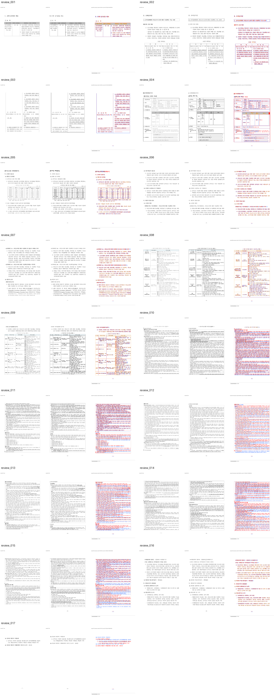

# PR #4122 검토 — #4069 중첩 RowBreak 저장 프레임 조판 복원

## 결론

**Draft PR 생성 및 로컬 검증 통과.** 중첩 표의 큰 행이 쪽 경계를 만나면 첫 쪽에서 조판을
시작하고 다음 쪽에서 같은 콘텐츠 위치부터 이어지도록 부분 렌더러의 cursor를 재귀 투영했다.
저장 `lineseg` 프레임과 셀 안의 빈 Enter 한 줄도 별도 의미로 보존한다.

최신 `upstream/devel`을 병합한 뒤 전체 release-test, Native Skia, clippy, doc test, 표준 Docker
WASM 빌드와 직접 로드를 통과했다. #4069 17쪽 전체 시각 스윕에서 누락·자동 flagged page가 없고,
작업지시자가 rhwp-studio에서 이 PR의 pagination 수정 범위를 시각 판정 통과로 확인했다. 최신 GitHub
Actions와 메인터너 승인 전에는 ready/merge하지 않는다.

## 검토 경로

```text
base route: collaborator_self_merge.md
modifiers: intake_and_review.md, local_validation.md,
           visual_fixture_evidence.md, multi_pr_update_branch.md
loaded documents: pr_review_workflow.md, pr_review/README.md,
                  collaborator_self_merge.md, intake_and_review.md,
                  local_validation.md, visual_fixture_evidence.md,
                  multi_pr_update_branch.md
base: d634e608b446f5496c893464104ee1c0a00ea9af
PR creation head: 917fa6abe825397051a8fc50dce5408a6f820e4f
validated code head: eb699faa2bd4b4d2427ed15b8eb3b17ea36737eb
```

별도 `review_impl` 문서는 만들지 않았다. 이 PR은 외부 기여를 메인터너가 재구현하는 검토가 아니라
메인터너가 단계별 커밋과 작업 문서로 직접 구현·검증한 self PR이며, 구현 근거는 Stage 1·2 문서와
이 검토 기록에 함께 고정돼 있다.

## 메타데이터

| 항목 | 값 |
| --- | --- |
| PR / 이슈 | [#4122](https://github.com/edwardkim/rhwp/pull/4122) / [#4069](https://github.com/edwardkim/rhwp/issues/4069) |
| 작성자 | `edwardkim` (collaborator self-merge) |
| 대상 / head | `devel` / `task_m100_4069` (upstream branch) |
| 생성 상태 | draft, open |
| 생성 시점 규모 | 7 files, +1,093 / -93, 5 commits |
| review request | 없음. 작성자와 인증된 메인터너 계정이 같고 별도 reviewer는 지정되지 않았다. |

위 규모와 head는 PR 생성 직후 스냅샷이다. 이 검토 문서와 대표 시각 asset을 추가하는 후속 문서
커밋으로 head와 문서 통계는 변한다.

## 변경 범위와 근인

- `src/renderer/layout/table_layout.rs`
  - 중첩 RowBreak 행을 canonical cell unit과 재귀 cursor로 투영한다.
  - 첫 등장과 다음 쪽 재개가 동일한 콘텐츠 오프셋 모델을 사용한다.
- `src/renderer/layout/table_partial.rs`
  - 문단 내부 저장 `lineseg` rewind를 프레임 경계로 보존한다.
  - 현재 프레임에 들어가는 짧은 자식 표를 다음 쪽으로 통째로 미루지 않는다.
  - 저장된 순방향 full-line 빈 문단은 실제 빈 Enter 한 줄로 보존하고, 장식 간격·control host·rewind는
    별도 의미로 제한한다.
- `tests/issue_2007_nested_cell_pagination.rs`
  - #4069의 2·3쪽 분할 재개, 10·11쪽 저장 프레임, 15·16쪽 자식 표 경계를 회귀 계약으로 고정한다.
- `tests/issue_2430_cell_rewrap_threshold.rs`
  - #2430 39쪽 유지와 물리 16쪽 셀의 빈 Enter 상단 간격을 고정한다.

근인은 기존 부분 렌더러가 전체 레이아웃과 다른 cursor를 사용하고 중첩 행을 원자 단위로 취급해,
첫 페이지에서 소비한 위치를 다음 페이지에 전달하지 못한 것이다. 또한 비인라인 1×1 RowBreak 셀의
빈 문단을 일괄 0높이로 접어 실제 빈 Enter까지 사라졌다.

## fixture와 정답지

| 역할 | 경로 | SHA-256 |
| --- | --- | --- |
| #4069 입력 | `samples/basic/issue2007_nested_cell_pagination_42065.hwp` | `bebd4ce3691246b0fb3ae332e1d40bc51d9035cddb9fc3d378466b6a8a2b5626` |
| #4069 한컴 2020 PDF | `pdf/basic/issue2007_nested_cell_pagination_42065-2020.pdf` | `9b0390f856bb9ad43337679babf6677209b7c7ab678b6616fcc6d6d5551ff1c4` |
| #2430 입력 | `samples/task2430/1382000_domestic_violence_survey.hwp` | `a3c6a227d26c41c7de9aa258f470001a629da90fa606cdddcbd385add43b7381` |
| #2430 한컴 2020 PDF | `pdf/issue2430/1382000_domestic_violence_survey-2020-print.pdf` | `5f92d3282c0772cd8fbe72e0fadfa49e2cde8ee7d788b6fbafe51bbd4e59e024` |

## 로컬 검증

최신 `upstream/devel` `d634e608b`를 병합한 코드 head `eb699faa2`에서 수행했다.

| 검증 | 결과 |
| --- | --- |
| `cargo test --profile release-test --tests` | exit 0. library 3,285 passed, 8 ignored, 0 failed; 모든 integration binary 통과 |
| focused renderer 회귀 | #4069 4, #2430 2, rowbreak chart overlap 20, overflow baseline 1 등 34 passed |
| Native Skia 공식 3종 | library 58, issue2225 2, direct PDF 4 passed |
| 정적 검사 | `cargo fmt --check`, `git diff --check`, `cargo clippy --all-targets -- -D warnings` 통과 |
| doc test | 4 passed, 2 ignored |
| 표준 Docker WASM | 성공, `rhwp_bg.wasm` SHA-256 `17e14d48222321195f8d42f6f1e998a883a720472fc67aab7d46d41c1b423549` |
| WASM Node 직접 로드 | #4069 17쪽, #2430 39쪽, #2430 물리 16쪽 상단 간격 24.94px |

## 시각 검증

- #4069 한컴 PDF와 rhwp 결과 17쪽을 전부 비교했다.
- requested/completed 17/17, missing 0, 자동 flagged page 0이다.
- 평균 pixel match는 89.75043%, 최저는 81.23829%다. 글꼴 raster 차이에 민감한 ink 기반
  visual accuracy proxy는 평균 15.05988%이므로 단독 합격 기준으로 쓰지 않았고, 구조별 자동 탐지와
  전 페이지 사람 판정을 함께 사용했다.
- 수정 지점인 2·3쪽 분할 재개, 10·11쪽 저장 프레임, 15·16쪽 자식 표 이음이 정답지 흐름과
  일치한다.
- #2430 물리 16쪽의 셀 상단 첫 문장 간격은 0.94px에서 24.94px로 회복됐다. 한컴 PDF 측 측정값은
  약 27px이다.
- 작업지시자가 rhwp-studio에서 이 PR의 pagination 수정 범위를 최종 시각 판정 통과로 확인했다.

2026-08-07 정답지는 2쪽의 `U+F02B1`이 사각형 안 숫자 1로 정상 출력된 한컴 PDF로 교체했다.
교체 전 PDF의 같은 표식에도 두부 글자 오류가 있어 Canvas2D의 기존 결함을 가렸지만, 이 결함은
#4122 변경에서 발생한 회귀가 아니다. 원문 PUA를 보존하는 IR과 CanvasKit 합성 경로는 정상이고,
기본 Canvas2D parity 보완은 #536 후속 stacked PR
[#4139](https://github.com/edwardkim/rhwp/pull/4139)로 분리한다.

대표 증거:



상세 작업 산출물은 로컬 `output/4069/stage3-final-validated/`에 유지한다. 저장소에는 검토자가 바로
열 수 있는 대표 contact sheet만 영구 asset으로 포함했다.

## 위험과 후속 게이트

- 중첩 표 pagination의 cursor와 빈 문단 높이는 전역 조판에 영향을 줄 수 있으므로 전체 library 및
  Native Skia 회귀를 필수 근거로 유지한다.
- pixel/ink 지표는 글꼴 렌더링 차이를 포함하므로 수치만으로 한컴과의 완전 동일성을 주장하지 않는다.
- PR 생성 직후 CI preflight, CodeQL preflight, Render Diff preflight가 시작됐다. 최신 문서 커밋이
  push되면 새 head 기준 required check를 다시 확인한다.
- issue는 PR 본문의 `Closes #4069`로 merge 시 닫히며, draft 생성 단계에서는 닫거나 별도 상태 변경하지
  않는다.

## 최종 권고

로컬 구현·WASM·시각 게이트는 통과했다. 이 검토 기록과 대표 asset을 push한 최신 head에서 GitHub
required checks가 성공하고 메인터너가 승인한 뒤에만 ready/merge한다.
