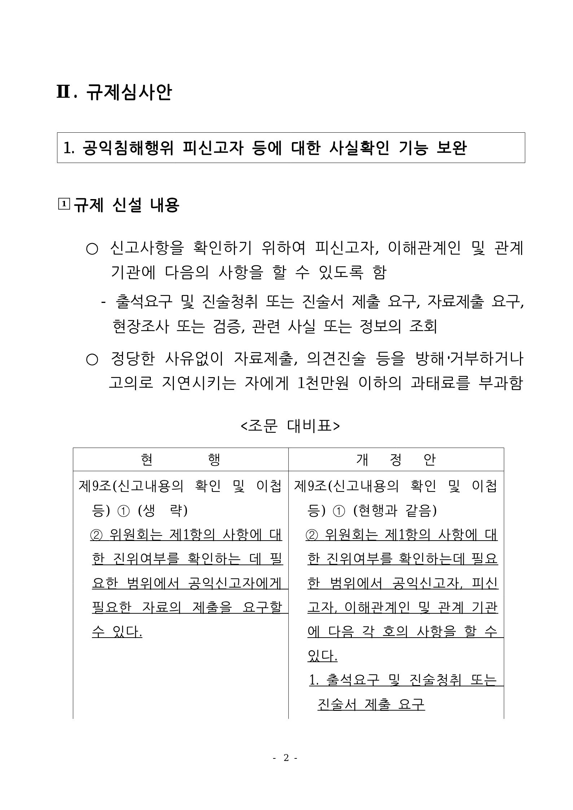

# PR #4139 검토 — Canvas2D 한컴 사각 안 숫자 PUA 폴백

## 결론

**stacked Draft PR 생성 및 로컬 검증 통과.** 기본 Canvas2D가 raw `U+F02B1`을 브라우저
글꼴에 맡겨 두부 글자를 출력하던 결함을, CanvasKit과 같은 bounded 사각형+숫자 합성으로
보완했다. 실제 HWP의 물리 2쪽에서 사각 외곽과 내부 숫자 잉크를 확인했다.

이 PR은 #4122의 pagination 변경 위에 쌓였지만 그 변경에서 발생한 회귀는 아니다. 작업지시자는
2026-08-07 대표 asset과 rhwp-studio 결과를 시각 판정 통과로 확인했다. #4122를 먼저 merge한 뒤
base를 `devel`로 retarget하고 최신 CI를 확인한 뒤에만 ready/merge한다.

## 검토 경로

```text
base route: collaborator_self_merge.md
modifiers: intake_and_review.md, local_validation.md,
           visual_fixture_evidence.md, multi_pr_update_branch.md
parent base/head: devel / task_m100_4069 @ 41404b4e5
stacked base/head: task_m100_4069 / task_m100_536_canvas2d_boxed_pua
validated code head: d705ad51cc3a3ecb0a50297463ef5f7d7c3441f1
```

## 메타데이터와 stack

| 항목 | 값 |
| --- | --- |
| PR / 추적 이슈 | [#4139](https://github.com/edwardkim/rhwp/pull/4139) / [#536](https://github.com/edwardkim/rhwp/issues/536) |
| 의존 PR | [#4122](https://github.com/edwardkim/rhwp/pull/4122) (`Depends on`, 먼저 merge) |
| 작성자 / assignee | `edwardkim` / `edwardkim` |
| milestone | `v1.0.0` |
| labels | `bug`, `rust`, `javascript`, `rhwp-studio`, `rendering`, `test` |
| 대상 / head | `task_m100_4069` / `task_m100_536_canvas2d_boxed_pua` |
| 생성 상태 | draft, open |

#536은 broad 멀티 렌더러 트래킹 이슈이므로 `Refs #536`으로 연결하고 닫지 않는다. #4122 merge
후 #4139의 base를 `devel`로 바꾼 뒤 diff와 mergeability를 다시 확인한다.

## 변경 범위와 근인

- `src/renderer/mod.rs`: `U+F02B1..U+F02C4`를 1..20으로 해석하는 공통 bounded helper와
  양쪽 경계 unit test를 추가했다.
- `src/renderer/web_canvas.rs`: 일반 텍스트와 effect pass에서 raw PUA를 건너뛰고 CanvasKit과
  같은 `0.72em` 사각형, `0.5em` 숫자, bounded stroke를 한 번만 합성한다.
- `rhwp-studio/e2e/issue-536-boxed-pua-canvas2d.test.mjs`: 실제 HWP 물리 2쪽을 최종 WASM
  Canvas2D로 렌더해 17쪽, raw PUA, `charOverlap=null`, 사각 외곽과 내부 숫자 잉크를 고정한다.
- 기존 한컴 PDF는 대상 표식에도 두부 글자 오류가 있어 결함을 가렸다. 작업지시자가 정상 변환한
  PDF로 교체하고 #4122의 해시와 시각 판정 범위를 pagination으로 명확히 제한했다.

IR·텍스트 폭·SVG의 raw PUA 보존, 실제 `CharOverlap`, CanvasKit·native Skia·PDF backend는
바꾸지 않는다.

## fixture와 정답지

| 역할 | 경로 | SHA-256 |
| --- | --- | --- |
| 입력 HWP | `samples/basic/issue2007_nested_cell_pagination_42065.hwp` | `bebd4ce3691246b0fb3ae332e1d40bc51d9035cddb9fc3d378466b6a8a2b5626` |
| 교체된 한컴 2020 PDF | `pdf/basic/issue2007_nested_cell_pagination_42065-2020.pdf` | `9b0390f856bb9ad43337679babf6677209b7c7ab678b6616fcc6d6d5551ff1c4` |
| 대표 Canvas2D PNG | `mydocs/pr/assets/pr_4139_536_boxed_pua_canvas2d_p002.png` | `850d181f4dfc8f3876904b006fd2612a333b1049bbb262cb91235370c2fe5cfe` |

한컴 PDF는 17쪽이고 `HANCOM OFFICE HANGUL 2010 8, 0, 0, 466`이 2026-08-07에 생성했다.
교체 전 PDF SHA-256은 `1f9d2f5705a64899c2b081832d2e6548dfe7bc3b9d1fb1b92f41221d39c8b3e7`이다.

## 로컬 검증

| 검증 | 결과 |
| --- | --- |
| release build | 통과 |
| release library | 3,286 passed, 8 ignored, 0 failed |
| `release-test --tests` | library와 모든 integration binary 통과; #2007 4건, IR/overflow baseline, SVG snapshot 포함 |
| Native Skia 공식 3종 | library 58, #2225 2, direct PDF 4 passed |
| 정적 검사 | fmt, staged/unstaged diff check, clippy `-D warnings` 통과 |
| doc test | 4 passed, 2 ignored |
| Studio | TypeScript 통과, sandbox 밖 공식 `npm test` 763/763 |
| WASM | `wasm-pack 0.15.0` web build 통과; SHA-256 `79fe6bc3c22741f7c6fd293a50e42e7f60d7ec27c874e7eb4af6ef2aafe54109` |
| 실제 HWP E2E | 17쪽, raw PUA, `charOverlap=null`, 사각 33x34px, 내부 숫자 잉크 82px |

sandbox 안 Studio test는 중첩 Node driver 5개의 종료코드가 0인데 stdout이 소실돼 155/160으로
실패했다. 같은 source와 test를 바꾸지 않고 sandbox 밖에서 공식 명령을 재실행해 763/763 통과했다.

## 시각 증적

- 임시 output: `output/536/issue2007_p002_canvas2d.png`
- 저장소 asset: `mydocs/pr/assets/pr_4139_536_boxed_pua_canvas2d_p002.png`
- 검토 페이지: 물리 2쪽 1장
- 자동 후보: 별도 full-page compare 후보를 사용하지 않고 대상 TextRun의 pixel topology를 직접 판정
- 결정 지표: 사각 잉크 33x34px, 예상 30.7px의 82%..118% 범위, 내부 숫자 잉크 82px
- 수행자 직접 확인: `규제 신설 내용` 앞 표식이 사각형 안 숫자 1로 표시됨
- 작업지시자 최종 시각 판정: 2026-08-07 통과



## 남은 게이트

1. #4122를 먼저 merge한다.
2. #4139 base를 `devel`로 retarget한다. 현재 workflow의 PR base filter가 `main`·`devel`이라
   stacked base에서는 checks가 생성되지 않으며, retarget 뒤 최신 head의 Actions를 확인한다.
3. diff·mergeability·required checks를 다시 확인한 뒤 ready/merge한다.
4. #536은 merge 뒤에도 open으로 유지한다.
