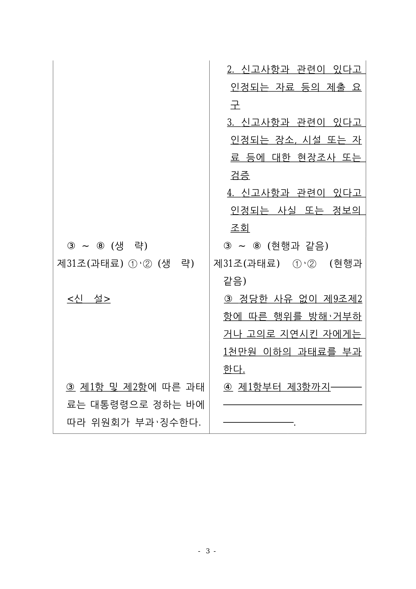

# PR #4174 검토 — #4159 종료 재귀 중첩 표 bottom clip 정합

## 결론

**Open PR 생성 및 최신 `devel` 기준 로컬 검증 통과.** 물리 3쪽에서 생성된 재귀 중첩 표의
종료 bottom 선이 조상 분할 셀 clip 밖에 놓여 잘리던 결함을 고쳤다. 마지막 유닛까지 소비한
terminal 셀만 실제 재귀 Table 자손의 하단을 포섭하고, 다음 continuation이 있는 비종료 조각은
기존 clip을 보존한다.

작업지시자가 rhwp-studio에서 물리 2쪽 사각 숫자와 물리 3쪽 표 하단선을 확인해 시각 판정을
통과시켰다. 최신 `upstream/devel` `23ff5b6f1`을 통합한 code head `e6f09003b`에서 전체 로컬
게이트와 새 WASM 브라우저 검증을 다시 통과했다. 최신 PR head의 GitHub Actions와 별도 merge
승인 전에는 병합하지 않는다.

## 검토 경로

```text
base route: collaborator_self_merge.md
modifiers: intake_and_review.md, local_validation.md,
           visual_fixture_evidence.md, multi_pr_update_branch.md
loaded documents: pr_review_workflow.md, pr_review/README.md,
                  collaborator_self_merge.md, intake_and_review.md,
                  local_validation.md, visual_fixture_evidence.md,
                  multi_pr_update_branch.md
initial base: 06f8ebcca0e119db23c50866f24348cae413ff7e
updated base: 23ff5b6f1
validated code head: e6f09003b19b1c9cf390feedf01eea9dcd0487bb
PR creation head: 356649d00bdef3eccbdf66dec49a0747cd3f4a6f
```

별도 `review_impl` 문서는 만들지 않았다. 외부 contributor 변경 위의 보정이나 다수 PR 통합이 아닌
collaborator self PR이고, 구현 순서와 rollback 범위는 계획·Stage 1·최종 보고서에 고정돼 있다.

## 메타데이터

| 항목 | 값 |
| --- | --- |
| PR / 이슈 | [#4174](https://github.com/edwardkim/rhwp/pull/4174) / [#4159](https://github.com/edwardkim/rhwp/issues/4159) |
| 작성자 | `edwardkim` (collaborator self-merge) |
| 대상 / head | `devel` / `task_m100_4159_nested_table_bottom_clip` (원본 저장소 branch) |
| 생성 상태 | open, non-draft |
| 생성 시점 규모 | 9 files, +600 / -2, 6 commits |
| 생성 시점 merge 상태 | mergeable, `BLOCKED` — CI 진행 중 참고값 |
| review request | 없음. 작성자와 인증된 메인터너 계정이 같아 별도 reviewer를 지정할 수 없다. |
| 1차 트리야지 | assignee `edwardkim`, milestone `v1.0.0`, labels `bug`, `rendering` |

위 head·규모·merge 상태는 PR 생성 직후 참고값이다. 이 review와 대표 asset을 추가하는 후속 문서
커밋으로 head와 통계가 바뀌므로 merge 전 최신 값을 다시 확인한다.

## 변경 범위와 근인

- `src/renderer/layout/table_partial.rs`
  - terminal `clip=true` TableCell의 bbox만 재귀 Table 자손의 실제 하단까지 확장한다.
  - 비종료 fragment와 중첩 표가 없는 셀은 기존 clip을 보존한다.
- `tests/issue_2007_nested_cell_pagination.rs`
  - 실제 물리 3쪽 bottom stroke가 모든 clip 조상 안에 있는지 구조적으로 고정한다.
  - SVG clip/bottom stroke 하단 `827.273px`, 물리 2쪽의 조기 terminal 노출 금지와 기존
    #4069 17쪽 계약을 함께 고정한다.
- `rhwp-studio/e2e/issue-4159-terminal-nested-bottom-border-canvas2d.test.mjs`
  - 새 WASM Canvas2D 물리 3쪽의 종료선 픽셀과 전체 17쪽을 검증한다.

근인은 재귀 중첩 표가 조상 셀의 top padding 아래에서 시작하면서 조상 조각과 같은 fragment 높이를
사용한 데 있다. bottom `Line`의 stroke 하단 `827.273px`은 조상 TableCell clip 하단
`824.880px`보다 약 1.89px 아래였고, SVG와 Canvas2D가 그 TableCell bbox를 clip으로 사용해
이미 생성된 선을 잘랐다.

## fixture와 정답지

| 역할 | 경로 | SHA-256 |
| --- | --- | --- |
| 입력 fixture | `samples/basic/issue2007_nested_cell_pagination_42065.hwp` | `bebd4ce3691246b0fb3ae332e1d40bc51d9035cddb9fc3d378466b6a8a2b5626` |
| 한컴 2020 기준 PDF | `pdf/basic/issue2007_nested_cell_pagination_42065-2020.pdf` | `9b0390f856bb9ad43337679babf6677209b7c7ab678b6616fcc6d6d5551ff1c4` |
| 대표 Canvas2D asset | `mydocs/pr/assets/pr_4174_4159_bottom_border_p003.png` | `6eb81636ab11f0acf9153f9c47406e7ce6e1bde879e93c4f52ba53b54953966c` |

## 로컬 검증

최신 `upstream/devel` `23ff5b6f1`을 통합한 code head `e6f09003b`에서 순차 실행했다.

| 검증 | 결과 |
| --- | --- |
| `CARGO_INCREMENTAL=0 cargo build --release` | PASS |
| `CARGO_INCREMENTAL=0 cargo test --release --lib` | 3,305 passed, 10 ignored, 0 failed |
| `CARGO_INCREMENTAL=0 cargo test --profile release-test --tests` | PASS, 모든 integration binary 통과 |
| Native Skia 공식 3종 | library 58, issue2225 2, direct PDF 4 passed |
| 정적 검사 | fmt, diff, 전체 타깃 Clippy `-D warnings` PASS |
| doc test | 4 passed, 2 ignored |
| Studio | TypeScript PASS, `npm test` 802 passed |
| release WASM | compile, wasm-bindgen, wasm-opt, `pkg` packaging PASS |
| 브라우저 E2E | #4159 PASS, #536 PASS, manifest 86/86 |

## 시각 검증

- 작업지시자가 rhwp-studio에서 물리 2쪽 사각 숫자와 물리 3쪽 표 전체 bottom 선을 확인해
  최종 시각 판정을 통과시켰다.
- 신규 E2E는 #4069 전체 17쪽을 유지하고 물리 3쪽 목표 선에서 1,203개 샘플 중 1,196개의
  선 잉크 픽셀을 검출했다.
- 한컴 2020 물리 3쪽과 Canvas2D 물리 3쪽을 대조해 좌·중·우 세로선과 전체 너비 bottom 선이
  모두 닫힌 것을 확인했다.
- 결함 위치 한 쪽의 구조·픽셀 판정이 목적이므로 전 문서 visual sweep의 pixel match 지표는
  사용하지 않았다. 원시 산출물은 로컬 `output/4159/`에 유지한다.

대표 증거:



## 위험과 후속 게이트

- 셀 clip 확장은 terminal 조건으로 제한했지만 전역 표 페이지네이션 경로이므로 전체 library,
  integration, Native Skia와 #4069 17쪽 계약을 필수 근거로 유지한다.
- PR 생성 직후 CI preflight, CodeQL과 Render Diff가 시작됐다. review 문서 후속 commit이 push되면
  최신 head 기준 required check를 다시 확인한다.
- issue는 PR 본문의 `Closes #4159`로 merge 시 닫히며, merge 전에는 별도로 닫지 않는다.

## 최종 권고

로컬 구현·WASM·시각 게이트는 통과했다. 이 review 기록과 대표 asset을 push한 최신 head에서
GitHub required checks가 성공하고 작업지시자가 별도로 승인한 뒤에만 merge한다.

## 2026-08-08 메인터너 재검토

### 기준과 범위

- 재검토 code candidate는 `5ebeb5d8813c89d3d057be354bdd311e18e87656`이다. 이 SHA의 GitHub
  Full CI(run `31186033675`), CodeQL(run `31186034468`), Render Diff(run `31186033605`)는 모두
  성공했다.
- 최신 `upstream/devel` `94fbcbedc97660078675532bbb2ee1d17b040f0c`을 source에 병합한
  `99a6d832c948f8c04d0e8ecdb0eeb19c9460efcf`의 current-base merge tree를 확인했다. 수동 source
  보정이나 conflict 해소는 없고, `git diff --check`도 통과했다.
- `table_partial.rs`의 확장은 continuation이 없는 terminal TableCell에만 적용되고, SVG·Canvas2D가
  실제로 사용하는 cell bbox clip을 재귀 Table 자손 하단까지 넓힌다. 비종료 fragment의 기존 clip을
  보존하므로 검토 중 추가할 코드 보정은 없다.

### 이번 재검토 검증

| 검증 | 결과 |
| --- | --- |
| `CARGO_TARGET_DIR=target/review-pr4174-20260808 CARGO_INCREMENTAL=0 cargo test --profile release-test --test issue_2007_nested_cell_pagination` | 6 passed, 0 failed |
| `wasm-pack build --target web --dev --out-dir pkg` | PASS. Docker가 설치되어 있지 않아 표준 Docker WASM 경로 대신 host fallback으로 실행 |
| `VITE_URL=http://127.0.0.1:7700 npm run e2e:issue-4159` | PASS. 17쪽 유지, 물리 3쪽 종료선 잉크 1,196 / 1,203 픽셀 |
| 물리 3쪽 Canvas2D 대표 PNG·crop 육안 확인 | PASS. 하단 수평선이 좌·중·우 세로선 사이에서 연속 |

`cargo test --profile release-test --tests`는 재검토 초기에 시작했으나, exact code candidate의 GitHub
Full CI가 이미 성공했고 이번 단계에 코드 보정이 없음을 확인한 뒤 중지했다. 이 명령은 완료 검증이
아니며 `PASS`로 취급하지 않는다. 이는 [PR 검토 워크플로우의 녹색 code head 재사용 규칙](../../manual/pr_review_workflow.md#322-녹색-github-code-head의-중복-로컬-전체-회귀-생략)에 따른
중복 회귀 생략이다.

대표 원시 산출물은 로컬 `output/4159/`에 있고, 안정 증적은 이미
`mydocs/pr/assets/pr_4174_4159_bottom_border_p003.png`에 보존돼 있다.

### 재검토 결론

새 결함은 발견하지 못했다. 이번 trailing 문서 head의 fast-pass 또는 fallback required checks가
성공하고 mergeability를 재확인하면 병합을 권고한다.
