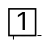

# PR #4227 검토 — #4158 실제 CharOverlap 사각 숫자 tofu 수정

## 결론

**Open PR 생성, 로컬 전체·집중 검증과 작업지시자 시각 판정 통과.** 실제 `CharOverlap`의
`U+F02B1..U+F02C4`를 숫자 1..20으로 해석하고 raw `borderType=0` 사각 숫자에 유효 사각 테두리를
합성한다. Canvas2D·SVG·Native Skia가 같은 의미 헬퍼를 사용하며 IR 원문과 명시적 border는 보존한다.

물리 10쪽 `공정거래위원회` 앞 표식은 tofu가 아니라 사각형 안 숫자 1로 출력된다. PR #4228은 이
branch를 base로 하는 별도 일반 `TextRun` PUA 수정이므로 #4227을 먼저 merge한다. 최신 PR head의
required checks와 review 승인, 작업지시자의 별도 merge 승인 전에는 병합하지 않는다.

## 검토 경로

```text
base route: collaborator_self_merge.md
modifiers: intake_and_review.md, local_validation.md,
           visual_fixture_evidence.md, multi_pr_update_branch.md,
           review_only_fast_pass.md
loaded documents: pr_review_workflow.md, pr_review/README.md,
                  collaborator_self_merge.md, intake_and_review.md,
                  local_validation.md, visual_fixture_evidence.md,
                  multi_pr_update_branch.md, review_only_fast_pass.md
devel base: 5a4f26d0d0a4e2fc96f4b73510d2aecdad916722
validated code head: 27932685bc9bcbfef2e1d191f51577f5bc28f4a0
```

별도 `review_impl` 문서는 만들지 않았다. 구현과 rollback 범위는 계획서·Stage 1·최종 보고서에 고정돼
있고, stack merge 순서는 #4227 뒤 #4228 한 단계로 명확하다.

## 메타데이터와 stack

| 항목 | 값 |
| --- | --- |
| PR / 이슈 | [#4227](https://github.com/edwardkim/rhwp/pull/4227) / [#4158](https://github.com/edwardkim/rhwp/issues/4158) |
| 후속 stack | [#4228](https://github.com/edwardkim/rhwp/pull/4228), #4227 merge 뒤 `devel`로 retarget |
| 작성자 / assignee | `edwardkim` / `edwardkim` |
| reviewer | `jangster77` 요청 |
| milestone / labels | `v1.0.0` / `bug`, `rendering` |
| 대상 / head | `devel` / `task_m100_4158_char_overlap_boxed_pua` |
| 생성 상태 | open, non-draft |
| 생성 시점 규모 | 14 files, +634 / -34, 5 commits |
| 접수 시점 merge 상태 | mergeable, `BLOCKED` — required check 진행 중 참고값 |

위 head·규모·merge 상태는 review 기록 전 참고값이다. 이 문서와 대표 asset을 추가하는 trailing
review-only commit 뒤 최신 값을 다시 확인한다.

## 변경 범위와 근인

- `src/renderer/mod.rs`: 단일 `CharOverlap`의 `U+F02B1..U+F02C4`만 1..20으로 해석하고 raw border
  0을 사각 테두리 3으로 투영한다.
- `src/renderer/web_canvas.rs`, `src/renderer/svg.rs`, `src/renderer/skia/text_replay.rs`: 세 backend가
  공통 effective border와 숫자를 사용한다.
- `rhwp-studio/e2e/issue-4158-char-overlap-boxed-pua-canvas2d.test.mjs`: 실제 HWP 물리 10쪽에서 raw
  IR 보존, 숫자 1, 사각 테두리와 raw PUA 미출력을 고정한다.

근인은 실제 `CharOverlap` PUA를 raw 글자로 브라우저 글꼴에 맡긴 것이다. 공개 fallback 글꼴에는 해당
glyph가 없어 tofu가 됐다. 일반 `TextRun`의 사각 PUA 폴백과 다중 문자 겹침은 이 PR 범위 밖이다.

## fixture와 시각 증적

| 역할 | 경로 | SHA-256 |
| --- | --- | --- |
| 입력 fixture | `samples/basic/issue2007_nested_cell_pagination_42065.hwp` | `bebd4ce3691246b0fb3ae332e1d40bc51d9035cddb9fc3d378466b6a8a2b5626` |
| 한컴 2020 기준 PDF | `pdf/basic/issue2007_nested_cell_pagination_42065-2020.pdf` | `9b0390f856bb9ad43337679babf6677209b7c7ab678b6616fcc6d6d5551ff1c4` |
| 대표 Canvas2D asset | `mydocs/pr/assets/pr_4227_4158_char_overlap_boxed_pua_p010.png` | `d05898acfa825fa0d735becf4298bec8e660e8f96cab40267c5055c87d8aca13` |

- 임시 산출물은 `output/4158/`에 있고 물리 10쪽 target crop 한 장을 안정 asset으로 보존했다.
- Canvas2D E2E 7개 계약이 17쪽, raw PUA·border 0 보존, `공정거래위원회` 문맥, 숫자 1과 사각선을
  판정한다.
- 작업지시자가 rhwp-studio에서 사각형 안 숫자 1을 확인해 시각 판정을 통과시켰다.
- 한 쪽의 특수 paint 결과가 목적이므로 전 문서 pixel-match sweep은 사용하지 않았다.



## 로컬 검증

- 최초 code candidate에서 release library 3,292 passed / 10 ignored, 전체 release-test integration
  suite, Native Skia 공식 58 + 2 + 4건, Clippy·fmt·diff·rustdoc·Studio TypeScript와 Node 22
  Studio 765건을 통과했다.
- 최신 `devel` 통합 뒤 현재 head에서 focused Rust 3건, Native Skia 2건, release WASM,
  #4158 7개·#536 6개·#4159 2개 Canvas2D 계약, manifest 87/87과 fmt·diff를 재통과했다.
- #4228을 포함한 stacked superset 후보에서도 전체 renderer 게이트와 새 WASM의 #4158 7개 계약이
  통과해 후속 PUA 변경과 함께 사용할 때의 회귀가 없음을 확인했다.

## GitHub Actions와 남은 게이트

- code head `27932685b`의 CI run `31232566318`, CodeQL `31232566275`, Render Diff
  `31232566247`이 모두 성공했다. CI의 Build & Test aggregate와 Native Skia, 네 test shard도 통과했다.
- 이 review-only commit은 위 녹색 code candidate의 fast-pass 재사용 대상이다. workflow가 fallback full
  CI를 선택하면 최신 head의 전체 완료를 기다린다.
- PR 본문의 `Closes #4158`은 merge 때 이슈를 닫는다. merge 전에는 이슈를 별도로 닫지 않는다.

## 최종 권고

구현·로컬·WASM·시각 게이트는 통과했다. review 기록이 포함된 최신 head의 required checks,
`jangster77` review와 mergeability를 재확인하고 작업지시자가 별도로 승인하면 #4227을 먼저 merge한다.
