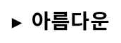

# PR #4228 검토 — #4224 `U+F02FB` 작은 오른쪽 방향 삼각형

## 결론

**Open stacked PR 생성, 로컬 전체·집중 검증과 작업지시자 시각 판정 통과.** 한컴 전용 일반
`TextRun` `U+F02FB`를 paint·텍스트 표면에서 표준 `U+25B8` `▸`로 투영한다. raw IR은 보존하고
Canvas2D·SVG·Native Skia가 기존 공통 PUA 표시 경로를 사용하므로 공개 글꼴에서도 tofu가 아닌 작은
오른쪽 방향 삼각형을 결정적으로 출력한다.

#4227은 `devel` merge commit `a377027ce`로 병합됐고 이 PR의 base도 `devel`로 변경했다. retarget
상태에서 mergeable과 독립 diff를 확인했다. 이 기록을 동기화한 최신 head의 required checks와 review,
작업지시자의 별도 merge 승인까지 확인해야 한다.

## 검토 경로

```text
base route: collaborator_self_merge.md
modifiers: intake_and_review.md, local_validation.md,
           visual_fixture_evidence.md, multi_pr_update_branch.md,
           review_only_fast_pass.md
loaded documents: pr_review_workflow.md, pr_review/README.md,
                  collaborator_self_merge.md, intake_and_review.md,
                  local_validation.md, visual_fixture_evidence.md,
                  multi_pr_update_branch.md, review_only_fast_pass.md
devel base: 5a4f26d0d0a4e2fc96f4b73510d2aecdad916722
full-gate candidate: 5f65690620fae86ad4429629cdb633e150619fac
normalized code head: e2ea73d696e757a2ff646eb1d1bfc7246a611497
parent review head: 7f9fde0ee579023f442728a7eec62a0c6078fc39
review-only merge bridge: ce8e39019ee900f29dee9259127b109c5acce8da
retarget devel base: a377027ced6d5a62b6722b8126da801a969d7dc6
retarget snapshot head: a28f0cddc68e294f27b281d354e967293cf46741
```

별도 `review_impl` 문서는 만들지 않았다. 구현과 rollback 범위는 계획서·Stage 1·완료 보고서에
고정돼 있고, #4227 merge와 #4228의 `devel` retarget 순서를 완료했다.

## 메타데이터와 stack

| 항목 | 값 |
| --- | --- |
| PR / 이슈 | [#4228](https://github.com/edwardkim/rhwp/pull/4228) / [#4224](https://github.com/edwardkim/rhwp/issues/4224) |
| 선행 PR | [#4227](https://github.com/edwardkim/rhwp/pull/4227), `a377027ce`로 merge 완료 |
| 작성자 / assignee | `edwardkim` / `edwardkim` |
| reviewer | `jangster77` 요청 |
| milestone / labels | `v1.0.0` / `bug`, `rendering` |
| 대상 / head | `devel` / `task_m100_4224_pua_f02fb_small_triangle` |
| 생성 상태 | open, non-draft |
| 생성 시점 규모 | 11 files, +412 / -10, 7 commits |
| 접수 시점 merge 상태 | mergeable, `CLEAN` |
| retarget 시점 규모 | 13 files, +552 / -10, 9 commits |
| retarget 시점 merge 상태 | mergeable |

workflow가 stacked feature branch base에서는 `main`·`devel` 대상 PR job을 시작하지 않아 접수 시점
status checks는 비어 있었다. #4227 review 기록을 전달하는 merge bridge는 정확히 두 부모를 가지며 첫
부모 대비 `mydocs/` 세 파일만 추가한다. #4227 merge 뒤 base를 `devel@a377027ce`로 retarget한 결과
13개 파일의 #4224 독립 diff만 남고 `git diff --check`와 mergeability가 통과했다. 이 기록을 push하는
`synchronize` 이벤트의 최신 CI를 최종 판정으로 사용한다.

## 변경 범위와 근인

- `src/renderer/hancom_pua.rs`: 검증된 한컴 PUA 표에 `U+F02FB → U+25B8(▸)` 한 항목을 추가한다.
- `tests/issue_4224_pua_f02fb_small_right_triangle.rs`: 실제 HWP의 raw IR 보존, 표시 문자열과 SVG를
  고정한다.
- `rhwp-studio/e2e/issue-4224-pua-f02fb-small-right-triangle-canvas2d.test.mjs`: 새 WASM의
  Canvas2D에서 `▸아름다운`, 글자 호출 순서와 raw PUA 미출력을 고정한다.

근인은 Supplementary PUA-A 문자를 raw 글자로 공개 글꼴에 맡긴 것이다. Windows의 실제
`함초롬돋움`에는 해당 glyph가 작은 검은 오른쪽 방향 삼각형으로 들어 있지만 공개 fallback 글꼴에는
없어 tofu가 됐다. #4158의 `CharOverlap` 사각 숫자와는 독립된 일반 `TextRun` 의미 매핑이다.

## fixture와 시각 증적

| 역할 | 경로 | SHA-256 |
| --- | --- | --- |
| 입력 fixture | `samples/basic/pau-004.hwp` | `b64725e39a8e1e6a3e53fca1652898eac893e8a48ff2f21a98c3a9a793aeff55` |
| 대표 Canvas2D asset | `mydocs/pr/assets/pr_4228_4224_pua_f02fb_p001.png` | `620888b28dccc0ad478ed7bb529151198972a9533f5a25f1356e34e4a910abd4` |

- 임시 산출물은 `output/pau-004/`에 있고, 물리 1쪽 target crop 한 장을 안정 asset으로 보존했다.
- Canvas2D E2E 6개 계약이 raw `U+F02FB` 보존, 표시 `▸아름다운`, 글자 호출 순서와 raw PUA
  미출력을 판정한다.
- 이 최소 fixture에는 독립 PDF 정답지가 없다. 한컴 문자표·실제 `함초롬돋움` glyph와 작업지시자의
  한컴 의미 확인을 oracle로 사용했다.
- 작업지시자가 rhwp-studio에서 작은 오른쪽 방향 삼각형과 #4158 사각 번호가 함께 출력되는 것을
  확인해 최종 시각 판정을 통과시켰다.



## baseline 변경 검토

전체 후보의 고유 source 변경은 renderer 표시 계층뿐이며 typeset·layout 경로를 바꾸지 않는다.
overflow-cell 원장은 현재 sweep에서 감소하거나 제거된 값만 다음과 같이 엄격하게 낮췄고, 증가한
항목은 없다.

| fixture | 이전 | 현재 |
| --- | ---: | ---: |
| `86712_regulatory_analysis.hwp` | 66 | 27 |
| `basic/issue2007_nested_cell_pagination_42065.hwp` | 2,980 | 0, 항목 제거 |
| `issue1891/86712_regulatory_analysis.hwpx` | 66 | 27 |
| `issue1949_giant_cell_nested_tables_perf.hwp` | 1 | 0, 항목 제거 |
| `issue1949_giant_cell_nested_tables_perf.hwpx` | 1 | 0, 항목 제거 |
| `issue3637/regulatory_impact_nested_table_escape.hwpx` | 601 | 177 |
| `table_giant_cell_overfill.hwpx` | 649 | 569 |
| `task1718/table_giant_cell_overfill.hwp` | 649 | 569 |
| `task2097/21217935_simsa_jipyo.hwp` | 30 | 26 |

갱신 뒤 676개 샘플(3 skipped), 20문서, 1,849줄의 현재 sweep과 TSV가 정확히 일치했다. IR field
sweep은 815개 샘플(3 skipped), 597 paths, 112,314건에서 기존 baseline과 동일했다.

## 로컬 검증

- full-gate candidate `5f6569062`: release library 3,307 passed / 10 ignored, 전체 release-test
  integration suite, Native Skia 58 + 2 + 4건, Clippy·fmt·diff·rustdoc을 통과했다.
- Studio TypeScript 검사와 Node 22 단위 테스트 802/802, release WASM, E2E manifest 88/88,
  #4158 7개와 #4224 6개 Canvas2D 계약을 통과했다.
- OVR5는 `devel@5a4f26d0d` 대비 5문서·142쪽·11개체에서 geometry 회귀 0건이다.
- 이슈 번호 정규화 head `e2ea73d69`: focused Rust 2/2, E2E manifest 88/88, Canvas2D 6개 계약과
  변경 Markdown 523개 링크 검사를 재통과했다.

세부 명령과 환경은 [Stage 1](../../working/task_m100_4224_stage1.md), 범위·rollback은
[수행계획](../../plans/task_m100_4224.md), 최종 결과는
[완료 보고서](../../report/task_m100_4224_report.md)에 고정돼 있다.

## GitHub Actions와 남은 게이트

- stacked base 시점에는 GitHub Actions 결과가 없었으므로 녹색 CI로 간주하지 않는다.
- #4227은 최신 CI·CodeQL·Render Diff 성공 뒤 `a377027ce`로 merge됐고 #4224 diff는 그 `devel` 위에서
  충돌 없이 분리됐다.
- retarget 자체는 `edited` 이벤트라 현재 workflow의 `opened|reopened|synchronize` trigger 대상이 아니다.
  이 검토 상태를 담은 trailing 문서 commit을 push해 최신 head의 CI·CodeQL·Render Diff를 시작하고
  실제 성공을 확인한다.
- PR 본문의 `Closes #4224`는 merge 때 이슈를 닫는다. merge 전에는 이슈를 별도로 닫지 않는다.

## 최종 권고

구현·로컬·WASM·시각 게이트와 `devel` retarget mergeability는 통과했다. trailing review commit의 최신
required checks와 `jangster77` review를 확인하고, 작업지시자의 별도 merge 승인이 있을 때만 #4228을
merge한다.
