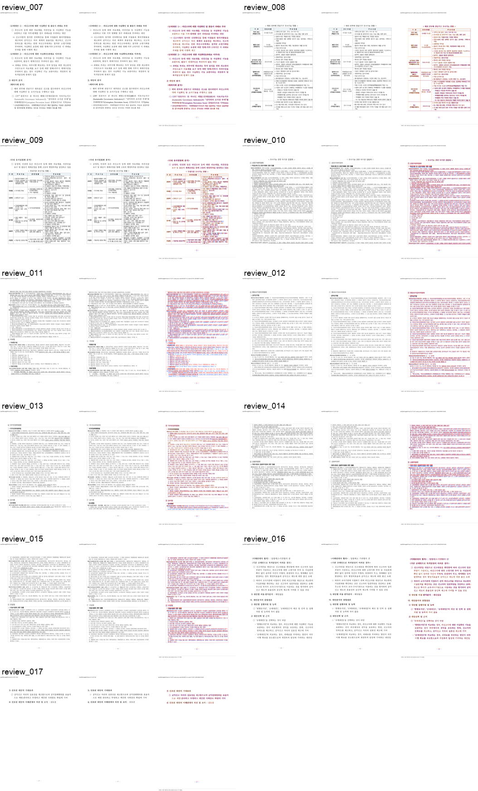

# PR #4257 검토 — #3820·#3821 중첩 표와 PDF fidelity 복원

## 결론

**Open PR 생성 및 최종 코드의 로컬 전체·WASM·시각 검증과 code candidate Full CI 통과.** 정책 연구 문서의
지연 Square 그림, 표·각주 page owner와 issue2007의 대형 중첩 `RowBreak` 표 분할을
단계별로 보정했다. 정책 문서는 한컴오피스 2020 기준 PDF와 `215/215`쪽,
issue2007은 `17/17`쪽이며 최종 p7–p17 PDF 직접 대조에서도 표 경계·간격·상단
continuation이 유지됐다.

PR 생성 code candidate `f82e03444dffc0a515d6f1aaa72f85af4629f7e8`의 Full CI·CodeQL·
Render Diff가 성공했다. 이 review·오늘할일·PR 번호 대표 asset만 single-parent trailing
commit으로 push한다. 최신 review-only head의 preflight와 `Build & Test` aggregate까지
성공하고 mergeability를 다시 확인해야 merge할 수 있다.

## 검토 경로

```text
base route: collaborator_self_merge.md
modifiers: intake_and_review.md, local_validation.md,
           visual_fixture_evidence.md, review_only_fast_pass.md,
           post_merge.md, rework_and_exceptions.md (>1000 lines)
loaded documents: pr_review_workflow.md, pr_review/README.md,
                  collaborator_self_merge.md, intake_and_review.md,
                  local_validation.md, visual_fixture_evidence.md,
                  review_only_fast_pass.md, post_merge.md,
                  rework_and_exceptions.md
devel base: fcc3b2135fa782699b66b583ddf11fe9f748306e
validated code head: f82e03444dffc0a515d6f1aaa72f85af4629f7e8
```

별도 `review_impl` 문서는 만들지 않았다. 외부 contributor 변경의 보정이나 여러 PR의
체리픽 통합이 아니라 #3820·#3821 self 작업이고, 단계별 구현·rollback 경계는 Stage 1–63과
종합 보고서에 이미 커밋 단위로 고정돼 있다.

## 메타데이터

| 항목 | 값 |
| --- | --- |
| PR | [#4257](https://github.com/edwardkim/rhwp/pull/4257) |
| 관련 이슈 | [#3820](https://github.com/edwardkim/rhwp/issues/3820), [#3821](https://github.com/edwardkim/rhwp/issues/3821) |
| 작성자 | `jangster77` (collaborator self-merge) |
| reviewer | `edwardkim` 요청 |
| 대상 / head | `devel` / `task/3820-3821-fidelity` (원본 저장소 branch) |
| 생성 상태 | open, non-draft |
| 생성 시점 규모 | 443 files, +199,464 / -5,260, 90 commits |
| 생성 시점 merge 상태 | mergeable, `BLOCKED` — CI 진행 중 참고값 |

위 head·규모·merge 상태는 PR 생성 직후 참고값이다. 이 review와 오늘할일을 추가하는
trailing 문서 commit으로 최신 head가 바뀌므로 merge 직전에 다시 확인한다.

## 대형 누적 diff의 검토 단위

1,000줄을 넘는 누적 PR이므로 즉시 merge하지 않고 구현, focused 회귀, 전체 회귀,
Native Skia, WASM/브라우저, PDF 직접 대조를 별도 cycle로 진행했다. 각 원인·수정·결과는
`mydocs/working/task_m100_3820_stage*.md`에 단계별로 커밋했고, Stage 63에서 새 전용
target으로 전체 공식 게이트를 처음부터 다시 실행했다.

핵심 변경은 다음 축으로 나뉜다.

- Square·TopAndBottom 그림의 bounded wrap owner와 page-top geometry
- 대형 중첩 `RowBreak` 표의 partial fragment, recursive cut, 각주·reset page owner
- terminal 표 clip, 표 뒤·제목 뒤 저장 간격과 PUA 표시 경로
- `visual_sweep.py`·`fidelity_compare.py`의 표 경계·본문 침범·owner 후보 검출
- 실물 HWP/HWPX, 한컴 2020 PDF, focused Rust·Python 회귀와 단계별 시각 증적

## 이슈 수용 범위

- #3821의 p156 Square-wrap 확정 결함은 수정·회귀·PDF 대조가 완료됐다. PR 본문은
  `Closes #3821` 종료 의도를 기록하지만 저장소 기본 branch는 `main`이고 대상 branch가
  `devel`이므로 자동 종료를 보장하지 않는다. merge 뒤 2–3회 재조회하고 여전히 OPEN이면
  승인 범위에서 수동으로 닫는다.
- #3820에서 확인한 정책 문서 page-owner 계열과 issue2007 결함은 해소됐다. 다만 #3820에는
  `76076_regulatory_analysis.hwp`, 행정업무운영 편람 등 별도 실문서 후보가 남아 있어
  `Related #3820`으로 유지하고 이번 PR만으로 이슈 전체를 닫지 않는다.

## 로컬 검증

최종 코드 게이트 SHA `74fecfd68ae0b479d2af422be6401c0b17efc0ae`와 그 결과를
기록한 code candidate `f82e03444`에서 순차 검증했다.

| 검증 | 결과 |
| --- | --- |
| issue2007 focused | 15/15 통과, 17쪽 유지 |
| #3637 focused | 3/3 통과 |
| #3385·#3385b·#4224 focused | 2 + 4 + 2 통과 |
| `cargo build --release` | PASS, 4분 17초 |
| `cargo test --release --lib` | 3,322 passed, 10 ignored, 0 failed |
| `cargo test --profile release-test --tests` | 최종 코드 재실행 PASS |
| overflow-cell baseline | 674개 샘플 스윕 PASS, 핵심 test 126.91초 |
| Native Skia 공식 3종 | 58 + 2 + 4 passed |
| 정적 검사 | fmt, diff, Clippy `-D warnings` warning 0 |
| rustdoc | 4 passed, 2 ignored |
| Studio | TypeScript PASS, unit 802/802 |
| fresh WASM | wasm-bindgen·wasm-opt·`pkg` packaging PASS, 2분 16초 |
| 브라우저 E2E | #536·#4158·#4224 PASS |
| E2E manifest | tracked 88 / manifest 88 |
| Markdown link | 전체 검사 대상 516개와 trailing 2개, 상대 링크 이상 없음 |

Clippy가 마지막에 보고한 `obfuscated_if_else` 두 건은 계산식과 조건을 유지한 명시적
`if/else`로만 바꿨다. 그 뒤 focused와 전체 release-test를 다시 실행했으므로 정리 전 결과를
최종 통과로 재사용하지 않았다.

## 시각 검증과 증적

| 역할 | 경로 | SHA-256 |
| --- | --- | --- |
| issue2007 입력 | `samples/basic/issue2007_nested_cell_pagination_42065.hwp` | `bebd4ce3691246b0fb3ae332e1d40bc51d9035cddb9fc3d378466b6a8a2b5626` |
| 한컴 2020 기준 PDF | `pdf/basic/issue2007_nested_cell_pagination_42065-2020.pdf` | `9b0390f856bb9ad43337679babf6677209b7c7ab678b6616fcc6d6d5551ff1c4` |
| sweep provenance | `mydocs/pr/assets/task_m100_3820_stage63_final_pr_gate/run_manifest.json` | `5faed808eea579c9cf3ecf4d96d9fe485c1acb38447a4d6f4aaa15941ddb5cca` |
| 대표 review asset | `mydocs/pr/assets/pr_4257_3820_issue2007_p007_p017_review.png` | `1473df90f77c39d9340fbc5d075d3201509d818e6c1361a02cd7bfd65d15a654` |

- p7–p17 requested/completed/missing은 `11/11/0`, 전체 SVG/render-tree는 `17/17`이다.
- 자동 구조 후보는 0쪽이며 평균 pixel match `90.35502%`, visual proxy `10.78162%`다.
  점수는 자동 합격으로 쓰지 않고 11쪽 모두 원본 크기로 PDF와 직접 대조했다.
- p7·p8의 추가 선 없음, p9–p15 표 경계, p12·p14·p15 block 간격,
  p16·p17 상단 continuation의 미잘림을 확인했다.
- 실행 원장과 페이지별 합성본은
  [Stage 63 증적](../assets/task_m100_3820_stage63_final_pr_gate/)에 보존한다.



## #4253과의 병합 경계

[PR #4253](https://github.com/edwardkim/rhwp/pull/4253)과 code candidate끼리 정확히 같은
경로는 `mydocs/manual/cli_commands.md` 하나다. 이 PR은 fidelity compare 설명부, #4253은
front matter·CLI 예·changelog를 바꿔 hunk가 겹치지 않는다. 현재 준비한 trailing 오늘할일까지
포함한 최종 후보끼리는 `mydocs/orders/20260808.md`가 두 번째 공통 경로지만, #4253은 상단에
기록을 삽입하고 #4257은 하단에 추가해 이 hunk도 겹치지 않는다. #4253 전체 patch의
`git apply --check`와 병합된 최신 `upstream/devel` 대상 merge simulation이 모두 통과했다.
renderer, 회귀 test, 작업 문서와 asset은 공통 경로가 없다.

#4253이 먼저 merge돼 현재 branch의 code SHA를 rebase로 바꾸면 새
`tests/edit_render_diff_gate.rs`를 포함한 최종 게이트를 다시 판정한다. base만 전진하고 source
code head를 바꾸지 않으면 review-only fast-pass를 위해 불필요한 rebase를 하지 않는다.

## GitHub Actions와 남은 게이트

- PR 생성 code candidate `f82e03444dffc0a515d6f1aaa72f85af4629f7e8`의
  [Full CI](https://github.com/edwardkim/rhwp/actions/runs/31250000302)는 성공했다. required
  [Build & Test](https://github.com/edwardkim/rhwp/actions/runs/31250000302/job/93086108407),
  Native Skia, 세 regular/slow shard와 lint·frontend package gate가 모두 성공했다.
- 같은 candidate의 [CodeQL](https://github.com/edwardkim/rhwp/actions/runs/31250000185)과
  [Render Diff](https://github.com/edwardkim/rhwp/actions/runs/31250000193)도 성공했다. preflight
  분류로 skip된 WASM·frontend unit은 최종 code head에서 로컬 fresh WASM과 Studio 802건으로
  별도 통과했다.
- 이 review·오늘할일·대표 asset만 single-parent trailing commit으로 push한다.
- 최신 trailing head의 preflight가 `fast_pass=true`를 선택하고 branch protection이 요구하는
  `Build & Test` aggregate가 성공해야 한다. heavy worker skip은 이 경우 정상이다.
- mergeability와 issue 상태를 최신 head에서 다시 확인한 뒤 작업지시자의 기존 자동 승인 범위에
  따라 merge와 후속 처리를 진행한다.

## 최종 권고

코드·전체 회귀·WASM·시각 게이트와 code candidate Full CI는 통과했다. trailing review-only
head의 required checks가 성공하면 #4257 merge를 권고한다. merge 뒤 #3821 close를 확인하고,
#3820에는 이번에 해결된 범위와 남은 별도 fixture 후보를 구분해 후속 기록을 남긴다.
