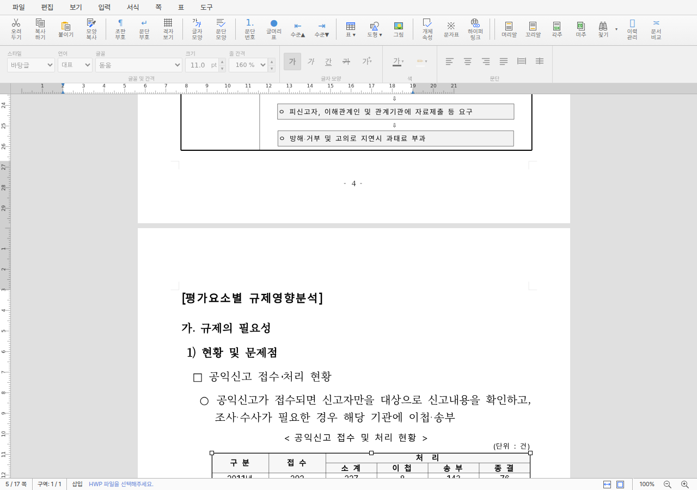

# PR #4267 검토 - 재귀 분할 중첩 표 객체 선택 경로 복원

## 결론

[PR #4267](https://github.com/edwardkim/rhwp/pull/4267)은 재귀 분할된 중첩 표의 렌더 트리에
합성 좌표가 선택 provenance로 노출되던 [#4252](https://github.com/edwardkim/rhwp/issues/4252)를
실제 enclosing `CellContext` 전달로 바로잡는다. 표 객체 선택과 부모 셀 caret 복귀가 실제 IR 경로를
사용하고, 선택 bbox는 기존 page-tree cache를 재사용하며 동일 `Esc` 이벤트의 중복 렌더를 제거한다.

코드 후보 `bd51c47964fdc8a0393c52e33094bc693a36a59e`는 전체 로컬 검증과 작업지시자의 최종
rhwp-studio 시각 판정을 통과했다. 최신 head의 GitHub Actions 성공과 reviewer `jangster77`의 검토,
작업지시자의 명시적 merge 승인 뒤 병합할 것을 권고한다.

## 검토 경로

```text
base route: collaborator_self_merge.md
modifiers: intake_and_review.md, local_validation.md,
           visual_fixture_evidence.md, rework_and_exceptions.md,
           review_only_fast_pass.md
loaded documents: pr_review_workflow.md, pr_review/README.md,
                  collaborator_self_merge.md, intake_and_review.md,
                  local_validation.md, visual_fixture_evidence.md,
                  rework_and_exceptions.md, review_only_fast_pass.md
devel base at PR creation: 59b31e5ce33ab61c4a907e715803304437174af9
code candidate: bd51c47964fdc8a0393c52e33094bc693a36a59e
```

별도 `pr_4267_review_impl.md`는 만들지 않았다. 구현 선택과 단계별 결과가 기존 수행·구현 계획 및
Stage 1~3 보고서에 이미 고정돼 있고, PR 접수 뒤 추가 코드 보정이나 충돌 해결이 없기 때문이다.

## 메타데이터

| 항목 | 값 |
| --- | --- |
| PR / issue | [#4267](https://github.com/edwardkim/rhwp/pull/4267) / [#4252](https://github.com/edwardkim/rhwp/issues/4252) |
| 작성자 / assignee | `edwardkim` / `edwardkim` |
| reviewer | `jangster77` |
| milestone / labels | `v1.0.0` / `bug`, `rhwp-studio`, `layout`, `table` |
| base / head branch | `devel` / `fix/issue-4252-nested-table-selection-path` |
| 생성 상태 | open, non-draft |
| 코드 후보 규모 | 5 commits, 16 files, +1,270 / -25 |
| 접수 시점 merge 상태 | mergeable, `BLOCKED` - required checks와 review 진행 중 |

위 상태값은 코드 후보 작성 시점의 snapshot이다. 이 리뷰 기록을 push하면 최신 head가 바뀌므로
required checks, review와 mergeability를 병합 직전에 다시 확인한다.

## 변경 범위와 대형 PR 판단

- 부분 표 재귀 호출이 합성 `(paragraph=0, control=0)` 대신 실제 enclosing cell 경로를 전달한다.
- hit-test가 같은 깊이의 유효한 원본 경로를 합성 traversal 경로로 덮지 않게 한다.
- 표만 포함한 부모 셀 문단의 caret anchor를 실제 경로에서 복원한다.
- Studio 표 객체 선택 bbox 조회는 기존 page-tree cache를 재사용하고, 동일 `Esc` 입력의 선택 렌더는
  1회만 수행한다.
- 실제 fixture 기반 래칫과 #2007·#4159·#3137 회귀 및 성능 계약을 함께 고정한다.

추가량이 1,000줄을 넘으므로 대형 PR 예외 경로를 적용했다. 이 가운데 약 405줄은 실제 fixture 경로를
고정하는 래칫이고, 7개 파일은 수행·구현 계획과 단계별 검증 기록이다. 서로 무관한 기능을 섞은 변경은
아니며, 코드 후보의 전체 검증과 외부 reviewer 검토가 끝나기 전 admin merge 대상으로 보지 않는다.

## 시각 근거



| 항목 | 값 |
| --- | --- |
| 재현 fixture | `samples/basic/issue2007_nested_cell_pagination_42065.hwp` |
| 검증 장면 | 물리 5쪽에서 페이지를 넘어 이어지는 자식 표를 `Esc`로 객체 선택 |
| 작업 산출물 | `output/4252/page5-child-table-object-selection.png` |
| PR 보존 자산 | `mydocs/pr/assets/pr_4267_page5_child_table_object_selection.png` |
| 자산 SHA-256 | `53230977d695316345e66512781db81d924776fa1a19737dd2f9d69af546dbe0` |
| 판정 | 선택 외곽선과 8개 handle, 부모 caret 복귀를 작업지시자가 rhwp-studio에서 통과 판정 |

이 근거는 한컴 정답지와의 픽셀 비교가 아니라 #4252의 상호작용 결함에 대한 대표 장면이다. 자동 E2E는
17쪽 로드와 3단계 선택 경로, 외곽선 1개, handle 8개, 선택 렌더 1회, 관련 경고 0건을 별도로 확인한다.

## 로컬 검증

| 검증 | 결과 |
| --- | --- |
| Rust release library | 3,348 passed, 13 ignored |
| 전체 release-test integration | 통과 |
| #4252 / #2007 집중 회귀 | 5 / 15 passed |
| Native Skia | 58 + 2 + 4 passed |
| Clippy / rustdoc / fmt / diff check | 통과 |
| Studio TypeScript / unit | 통과 / 813 of 813 passed |
| E2E manifest | 90 of 90 |
| #4252 선택 E2E | 17쪽, 경고 0, 선택 렌더 1회, 물리 5쪽 bbox median 0.4ms |
| #4159 시각 회귀 | 17쪽, 종료선 1,309 / 1,316 pixels |
| #3137 입력 성능 probe | operation p95 1.80ms, full repaint·long task·sync flush 0 |
| Docker release WASM | 7,701,996 bytes, SHA-256 `328457d78e7af88ced916a63811f8ad76cca12c6762777ac6aca6f69d3dadd5b` |
| dev server 적용 | 제공 WASM과 위 SHA-256 일치 |
| 작업지시자 시각 판정 | 통과 |

Studio 단위 테스트는 최초 sandbox 실행에서 자식 Node `spawnSync` 5건이 `EPERM`으로 차단된 뒤,
동일 전체 명령을 sandbox 밖에서 재실행해 813건 전부 통과했다. 이는 코드 결함이 아니라 실행 환경
제한이며, 프로젝트 가드레일에 따라 이후 Node 자식 프로세스 검증은 처음부터 sandbox 밖에서 수행했다.

## 위험과 완화

- 재귀 깊이별 cell path 출처가 바뀌므로 중첩 표 hit-test와 caret 복귀가 주 위험이다. 실제 3단계
  fixture 경로 래칫과 #2007 15건으로 완화했다.
- cache 재사용이 낡은 page tree를 읽을 위험은 기존 invalidation 계약을 유지하고 #4252 E2E의 bbox,
  selection render 횟수와 경고를 함께 확인해 완화했다.
- 입력 성능 저하 위험은 새 전 페이지 탐색이나 idle 작업을 추가하지 않고 기존 조판 시점의 context만
  전달했으며, #3137 probe와 #4252 실측에서 long task·full repaint·동기 flush 0건을 확인했다.

## GitHub Actions와 review-only trailing commit

코드 후보의 CI preflight, CodeQL preflight, Render Diff preflight, JS/TS·Python CodeQL, lint와 frontend
package gate는 성공했고, 문서 작성 시점에는 Rust CodeQL·Canvas visual diff·Native Skia·test archive
및 shard가 진행 중이다. 완료로 추정하지 않고 최신 head에서 다시 조회한다.

이 문서, 오늘할일 갱신과 보존용 PNG만 담는 후속 commit은 코드 후보 뒤의 review-only 변경이다.
코드 후보 CI가 green이면 workflow의 fast-pass 계약으로 그 결과를 재사용할 수 있으나, 아직 실행 중인
검사를 성공으로 기록하지 않는다. 최신 trailing head의 preflight와 최종 aggregate, reviewer 상태와
mergeability를 모두 확인해야 한다.

## 최종 권고

변경 원인, 회귀 계약, 성능 경계와 시각 근거는 타당하므로 **조건부 merge 권고**다. 최신 head의 모든
required checks 성공, reviewer `jangster77`의 검토 완료, 작업지시자의 명시적 merge 승인 전에는
review 게시·merge·issue close를 수행하지 않는다. 병합 시 `Closes #4252`로 연결 이슈가 닫히는지
확인하고, 이후 최신 `devel` 동기화와 작업 branch 정리 범위를 별도로 확인한다.
