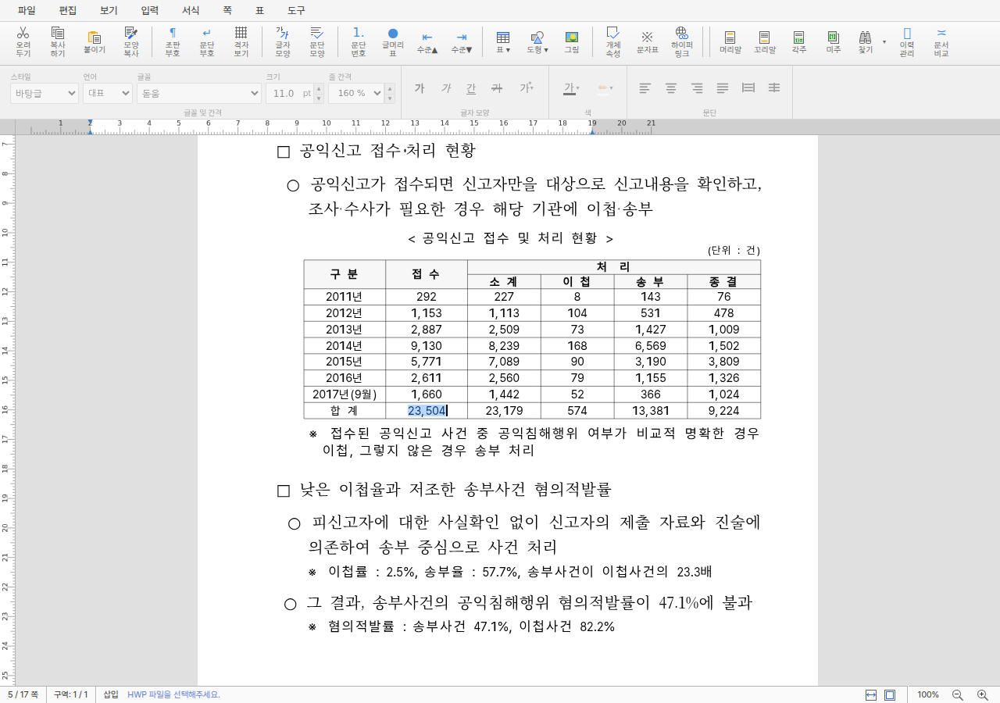

# PR #4276 검토 — 중첩 셀 선택·복사를 전체 경로로 처리

## 결론

**수용 권고.** [PR #4276](https://github.com/edwardkim/rhwp/pull/4276)은 중첩 표 셀의 선택
하이라이트, 선택 텍스트 복사·붙여넣기와 중첩 표 객체 복사를 평면 셀 좌표가 아닌 전체 `cellPath`로
처리한다. 기존 깊이 1 API는 유지하고 경로 API를 additive하게 추가했으며, 실제 17쪽 fixture의 깊이 3
사용자 여정 세 가지와 전체 Rust·Studio·Skia·WASM 검증이 통과했다.

blocking finding은 없다. 다만 +1,998/-101의 대형 PR이므로 즉시 admin merge하지 않고, 이 review-only
후속 commit의 최신 CI와 mergeability를 다시 확인한 뒤 self-review `COMMENT` 게시와 merge를 각각
작업지시자 승인으로 진행한다.

## 검토 경로

```text
base route: collaborator_self_merge.md
modifiers: intake_and_review.md, local_validation.md,
           visual_fixture_evidence.md, rework_and_exceptions.md,
           review_only_fast_pass.md
loaded documents: pr_review_workflow.md, pr_review/README.md,
                  collaborator_self_merge.md, intake_and_review.md,
                  local_validation.md, visual_fixture_evidence.md,
                  rework_and_exceptions.md, review_only_fast_pass.md
devel base: e4d07fab713828266c3f365ebf862306b739f24a
code candidate: 7da15f3462326b699becb0fcbb31823068d4db36
```

별도 `pr_4276_review_impl.md`는 만들지 않는다. 구현·범위 분리는 #4272 계획과 Stage 1–3에서 완료했고,
review 과정에서 추가 code 보정이나 conflict 해결이 필요하지 않아 이 문서의 조건만으로 남은 순서가
명확하다.

## 메타데이터

| 항목 | 값 |
| --- | --- |
| PR | [#4276](https://github.com/edwardkim/rhwp/pull/4276) |
| 관련 이슈 | [#4272](https://github.com/edwardkim/rhwp/issues/4272), PR 본문 `Closes #4272` 확인 |
| 후속 이슈 | [#4275](https://github.com/edwardkim/rhwp/issues/4275) — 교차 문서 표 붙여넣기 셀 스타일 손실 |
| 작성자 / assignee | `edwardkim` / `edwardkim` |
| reviewer | 작업지시자 승인 `edwardkim` maintainer self-review |
| GitHub review request | 작성자 자기 PR에는 reviewer 요청을 등록할 수 있어 별도 request를 만들지 않음; 빈 목록 재확인 |
| milestone / labels | `v1.0.0` / `bug`, `rhwp-studio`, `api`, `rendering`, `test`, `table` |
| base / source | `devel` / `fix/issue-4272-nested-cell-text-selection` |
| 접수 시점 head | `7da15f3462326b699becb0fcbb31823068d4db36` |
| 접수 시점 규모 | 10 commits, 24 files, +1,998 / -101 |
| 접수 시점 상태 | open, non-draft, MERGEABLE/CLEAN; code candidate의 required checks 성공 |

위 상태는 review 기록 작성 시점 참고값이다. 이 문서와 대표 asset을 push한 최신 head의 CI와
mergeability를 merge 직전에 다시 확인한다.

## 변경 범위와 코드 검토

1. `SelectionCellTarget`이 기존 평면 셀과 전체 경로 셀을 분리한다. 경로 매칭은 깊이와 중간 엔트리를
   모두 정확히 비교하고, 선택 범위에서 변하는 마지막 `cellParaIndex`만 현재 문단 축으로 대체한다.
2. 선택 rect API는 endpoint page hint가 있으면 해당 host page만 조회한다. hint가 없을 때만 기존
   fallback을 사용하며, 마우스 이동·렌더 프레임마다 문서 IR 전체를 새로 순회하는 경로를 추가하지 않았다.
3. plain text와 HTML 복사는 선택 문단마다 마지막 path 엔트리만 바꿔 같은 최내곽 셀을 해석한다.
   `cellParaIndexOf()`를 사용해 물리 11쪽의 바깥 호환 인덱스 `0`과 실제 최내곽 문단 `22`를 혼동하지 않는다.
4. 표 객체 복사는 선택용 full path의 마지막 `controlIndex`를 대상 표로, 앞쪽 prefix를 소유 문단
   경로로 변환한다. 키보드 Ctrl+C와 command `performCopy()`가 같은 순수 헬퍼를 사용한다.
5. 기존 평면 API와 깊이 1 동작은 보존된다. 중첩 표 잘라내기·삭제와 교차 문서 HTML import 스타일
   교정은 이 PR에 섞지 않았고, 후자는 #4275로 분리했다.

공개 WASM 경로 API와 Studio bridge의 인자 순서를 대조했고, native clipboard 변경이 문서 IR이 아니라
세션 `self.clipboard`에만 기록됨을 invalidation guard에 명시했다. 새 panic·unchecked 외부 입력 경로와
blocking 성능 문제는 발견하지 못했다.

## 로컬 검증

code candidate `7da15f346`에서 다음 결과를 확인했다.

| 검증 | 결과 |
| --- | --- |
| `cargo build --release` | PASS |
| `cargo test --release --lib` | 3,361 passed, 13 ignored |
| 전체 `cargo nextest` | 5,484/5,484 passed, 35 skipped |
| native Skia lib / fixture / direct PDF | 58/58, 2/2, 4/4 passed |
| `cargo fmt --all -- --check`, `git diff --check` | PASS |
| `cargo clippy --all-targets -- -D warnings` | PASS |
| doctest | 4 passed, 2 ignored |
| Studio `npx tsc --noEmit` | PASS |
| Studio 전체 `npm test` | 819/819 passed |
| 표준 Docker WASM | PASS, `pkg/rhwp_bg.wasm` SHA-256 `78658b33f55919407295491c72678bbdf2327968f0a700404a50b08d10b226ca` |
| #4272 headless E2E 3종 | 선택·복사·붙여넣기, 물리 11쪽 복사, 3중 표 객체 복사 모두 PASS |
| review 기록 3개 파일 상대 링크 검사 | PASS |
| review-only 변경 `git diff --check` | PASS |

Studio 전체 테스트는 `spawnSync()` 샌드박스 `EPERM` 오탐을 피하도록 처음부터 샌드박스 밖에서 실행했다.
Skia 최초 빌드는 샌드박스 DNS 제한으로 binary 다운로드가 실패해 네트워크 허용 환경에서 같은 명령을
재실행했고 58/58을 통과했다. 표 객체 E2E 최초 실행은 단언 전에 Chrome launcher가 종료됐으나 같은
명령 재실행에서 모든 단언과 브라우저 warning/error 0건 조건을 통과했다.

저장소 전체 `scripts/check_document_metadata.py`는 이번 diff 밖의 기존 기술 문서 2개에서 오류 3건을
재현했다(`envelope_provenance.md`의 `kind`, `task_m100_3604_password_encryption_cpp_review.md`의
`canonical`·`kind`). 새 review 문서와 변경한 작업 기록에서는 해당 오류가 없고, 파일 단위 상대 링크
검사는 3/3 통과했다.

## CI와 review-only 후속 commit

code candidate의 [CI run 31277452707](https://github.com/edwardkim/rhwp/actions/runs/31277452707)은
Lint, Frontend package, Native Skia, 네 test shard와 Build & Test aggregate가 모두 성공했다.
[CodeQL run 31277452587](https://github.com/edwardkim/rhwp/actions/runs/31277452587)은
JavaScript/TypeScript·Python·Rust 분석이 모두 성공했고,
[Render Diff run 31277452584](https://github.com/edwardkim/rhwp/actions/runs/31277452584)의 Canvas visual
diff도 성공했다.

이 review 문서·오늘할일·대표 PNG는 모두 `mydocs/` 아래의 single-parent trailing review-only
commit이다. push 뒤 최신 head preflight가 code candidate의 녹색 결과를 정확히 재사용하는지와 최종
Build & Test aggregate를 다시 확인한다.

## 시각·fixture 증적

- 원본 fixture: `samples/basic/issue2007_nested_cell_pagination_42065.hwp`
  - SHA-256: `bebd4ce3691246b0fb3ae332e1d40bc51d9035cddb9fc3d378466b6a8a2b5626`
- 임시 CDP 증적: `output/4272/nested-cell-text-selection.png`
- 안정 대표 asset: [review_4276.png](../assets/review_4276.png)
  - 양쪽 SHA-256: `68fa461bd775869bbc312711982bf72446de135169bad10440af810dc14bf0a5`

물리 5쪽 한 페이지에서 자동 탐색한 깊이 3 `23,504` 선택 후보를 사람이 확인했다. 선택 하이라이트
1개, 선택 문자열과 붙여넣기 결과 `23,504`, path API 17회 합계 약 3.3ms, 브라우저 warning/error 0건이었다.
이 검증은 선택 overlay의 기능·상태 증적이며 기준 PDF와의 pixel sweep이 아니므로 pixel match와
`visual_accuracy_proxy_percent`는 적용하지 않는다. 작업지시자의 rhwp-studio 사용자 여정 판정도
통과했다.



## 발견한 문제와 위험

blocking finding은 없다. 남은 위험은 구버전 WASM과 최신 Studio를 혼합 배포하면 신규 path API가 없다는
점이지만, 프로젝트 배포 절차는 같은 source head에서 Docker WASM과 Studio package를 함께 검증한다.
교차 문서 HTML 붙여넣기의 셀 BorderFill·ParaShape·font fallback 손실은 이 PR의 주소 교정과 원인이 달라
#4275로 추적한다.

## 최종 권고

다음 조건을 모두 충족하면 merge를 권고한다.

1. review-only 후속 commit을 포함한 최신 PR head의 preflight와 required aggregate가 성공한다.
2. 최신 head가 MERGEABLE/CLEAN인지 다시 확인한다.
3. 작업지시자 승인 뒤 maintainer self-review 결과를 `COMMENT`로 게시한다.
4. 별도 merge 승인 뒤 PR을 merge하고 `Closes #4272` 반영 여부를 확인한다.
