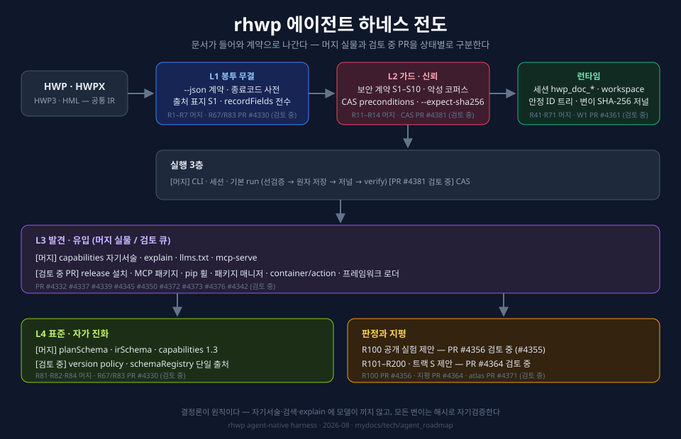

# 동향: 2026 W32에 대사한 2026년 하네스 논문 5편 (#4383)

2026 W32에 대사한 2026년 에이전트 **하네스(harness/scaffold) 논문 5편**을 실측
인용하고, 각 축을 이 저장소의 **머지 실물**과 **검토 중인 open PR**에 나눠
대사한다. 다섯 편의 최초 제출일은 각각 2026-04-18, 2026-06-11,
2026-07-04, 2026-07-30, 2026-08-05이며, 이 중 2026 W32에 최초 제출된
논문은 2608.05446 한 편이다.
[trend_survey_2026h2.md](trend_survey_2026h2.md) 의 5관문을 승계하며, 서술
원칙은 하나다 — **연구가 벤치마크로 말할 때 이 저장소는 계약 테스트와 상태가
표시된 구현 링크로 말한다.** open PR은 후보이지 채택·머지·배포된 기능이 아니다.
실명 우위 주장이 아니라 "이 동향과 대응하는 근거가 어디까지 실물인가"를
확인하는 대사다.

## 대사표 (논문 실측 → 머지 실물 / 검토 중 PR)

| 논문 (2026, arXiv 최초 제출일) | 축 | 이 저장소의 머지 실물 / 검토 중 PR |
|---|---|---|
| [하네스 진화가 코딩 에이전트 품질을 지배한다](https://arxiv.org/abs/2607.03691) (2607.03691, 2026-07-04; v2 2026-07-20) | 모델이 아니라 **하네스가 품질 변수** | **머지 실물:** 자기서술·계약·게이트를 제품 표면으로 다루는 R1~R100 로드맵과 진행 집계(R94). **검토 중 PR:** R1~R200 전도·atlas([#4371](https://github.com/edwardkim/rhwp/pull/4371)). |
| [Harness as an Asset — 결정론 강제](https://arxiv.org/abs/2604.17025) (2604.17025, v1 2026-04-18; v2 2026-04-25; v3 2026-05-04) | 하네스 수준의 **결정론** | **머지 실물:** 자기서술·검색·explain의 모델 무개입(R31·R33), 기본 run 계획. **검토 중 PR:** 안정 노드 ID 트리와 변이 SHA-256 저널(#4361), 계획 `preconditions.inputSha256` + `edit --expect-sha256` CAS([#4381](https://github.com/edwardkim/rhwp/pull/4381)). |
| [EvoHarness-RL — 장기 지평 자기진화 런타임 하네스](https://arxiv.org/abs/2608.05446) (2608.05446, 2026-08-05; 2026 W32) | 하네스의 **자기 진화** | **검토 중 PR:** version policy canonical + schemaRegistry 단일 출처(R67·R83, [#4330](https://github.com/edwardkim/rhwp/pull/4330)), 트랙 S를 포함한 R101~R200 지평([#4364](https://github.com/edwardkim/rhwp/pull/4364)). **비목표:** 학습(RL) 기반 하네스 변형은 결정론·감사 가능성과 다른 축이므로 채택하지 않는다. |
| [Agent Harness Distillation — 하네스 추출·악용](https://arxiv.org/abs/2607.28147) (2607.28147, 2026-07-30) | 하네스 **보안 표면** | **머지 실물:** 보안 계약 S1~S10, 출처 표지(문서 파생 값=데이터, 지시 아님), inspect injection/hidden-text/unicode 3축, 악성 코퍼스 회귀(R2·R13·R14). |
| [Recursive Agent Harnesses](https://arxiv.org/abs/2606.13643) (2606.13643, 2026-06-11) | **계층·재귀** 하네스 | **머지 실물:** 무상태 CLI, 세션, 기본 run 계획. **검토 중 PR:** 안정 ID·저널을 갖춘 persistent workspace(#4361), CAS(#4381), 트랙 C·지평 P를 포함한 R101~R200 제안(#4364). 구현 완료 주장이 아니다. |

접속일 2026-08-10. 제목·최초 제출일·개정일은 각 행의 arXiv abstract/version
history로 확인했다. 상태 구분도 2026-08-10 기준이며, 검토 중 PR은 merge 전에
변경되거나 닫힐 수 있다. 같은 날 GitHub에서 #4330, #4364, #4371, #4381이 모두
`OPEN`이고 merge되지 않았음을 다시 확인했다.

## 이 대사가 로드맵에 주는 것

1. **R100 공개 실험(#4355)의 시의성** — 하네스 품질을 *측정*하자는 흐름과 맞닿아
   있다. 무안내 30분·측정 대장 프로토콜은 PR #4356에서 검토 중이며, merge 전에는
   저장소의 채택된 실험 계약으로 표현하지 않는다.
2. **트랙 S 승격 재료** — 2608.05446 계열의 "자기 진화" 수요가 외부 실측으로
   추가됐다(지평 S 트랙의 승격 조건란에 축적).
3. **보안 축(R15~R20) 우선순위 근거** — 하네스 추출·악용이 연구 대상이 된 이상,
   가드 커버리지 자기서술(R20)의 가치가 올라간다.

## 하지 않는 것

- 실명 성능 비교·서열 주장 — 원리와 실물 링크만 남긴다(전 조사 문서 공통 규율).
- RL 기반 하네스 자가변형 채택 — 위 비목표 명시.
- open PR을 머지 실물·배포 기능으로 표현 — 상태가 바뀌면 이 문서와 SVG를 함께
  다시 대사한다.
- 이 문서로 등급 변경 — 승격 재료는 각 트랙·지평 문서의 게이트가 소비한다.
