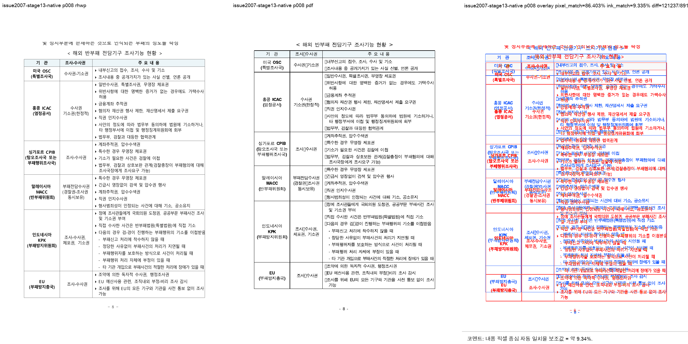
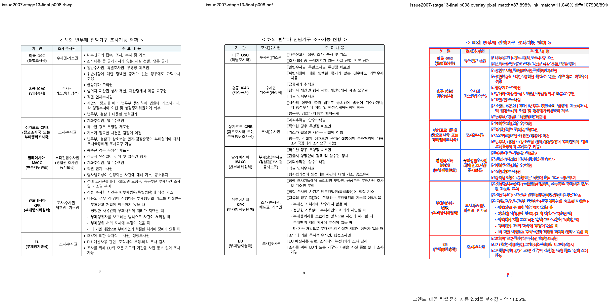
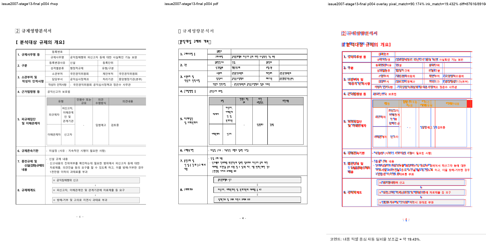
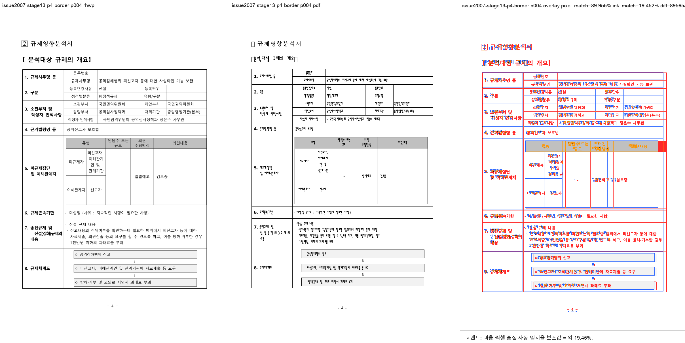
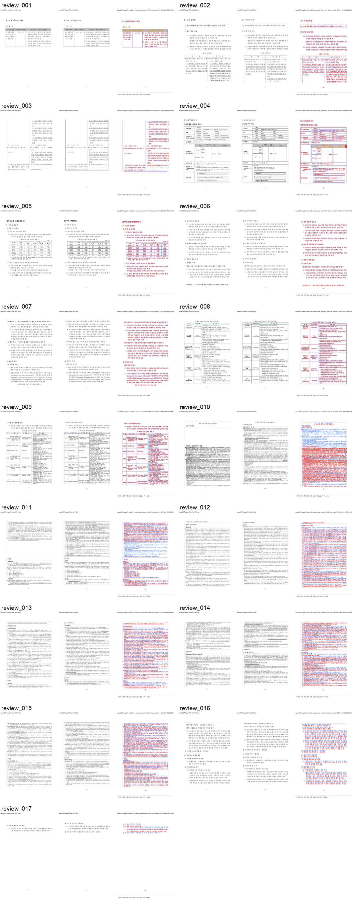
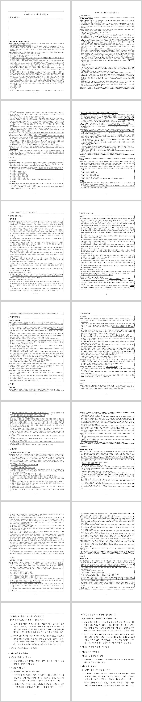
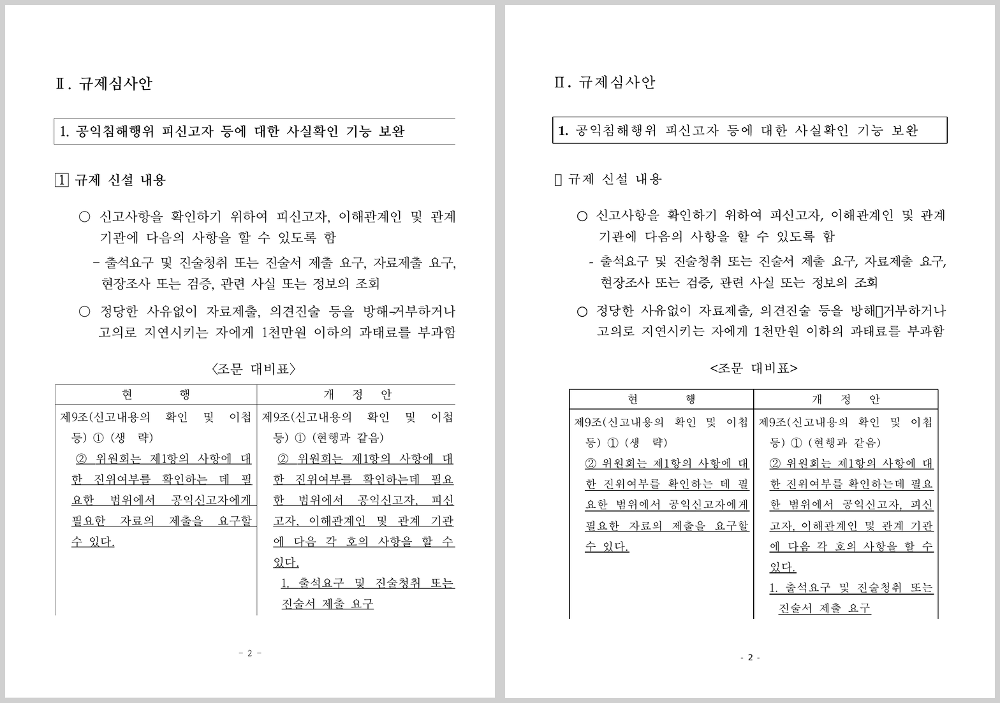

# Task #3820 Stage 13 visual sweep — issue2007 nested-cell continuation

## 기준·실행·보관

- 입력 HWP: [`samples/basic/issue2007_nested_cell_pagination_42065.hwp`](../../samples/basic/issue2007_nested_cell_pagination_42065.hwp)
- 한컴 2020 기준 PDF: [`pdf/basic/issue2007_nested_cell_pagination_42065-2020.pdf`](../../pdf/basic/issue2007_nested_cell_pagination_42065-2020.pdf)
- 대상은 현재 `issue2007*.hwp` glob의 단일 fixture이며, 기준 PDF와 rhwp 모두 17쪽이다.

```text
python3 scripts/visual_sweep.py \
  --rhwp-bin target/task-3820-3821-fidelity/release-test/rhwp \
  --key issue2007-stage13-final \
  --hwp samples/basic/issue2007_nested_cell_pagination_42065.hwp \
  --pdf pdf/basic/issue2007_nested_cell_pagination_42065-2020.pdf \
  --pages 1-17 \
  --out /tmp/rhwp-issue2007-stage13-final-sweep-20260805
```

초기 전수 기록의 `17/17/0` page-count는 페이지가 존재한다는 뜻일 뿐 레이아웃 합격이 아니다. 사용자
직접 검토에서 p10–p16의 본문 겹침을 발견했으므로, 아래의 p10–p16 재실행 결과로 종전 합격 서술을
대체한다. HWP와 PDF는 canonical 위치에 있으므로 중복 보관하지 않았고, 생성 PNG/TSV는
`pdf-large/**/*.pdf` LFS pattern 대상이 아니어서 일반 Git 증적으로 보관한다.

## 직접 판정

| 범위 | 수정 전 | 수정 후 직접 PDF 대조 |
| --- | --- | --- |
| p4 | 큰 중첩 표의 우측 outer vertical border가 SVG에는 emit됐지만 parent `body-clip`/`cell-clip`에 완전히 가려짐 | direct nested Table의 outer vertical stroke만 physical cell clip의 가로 범위에 포함. PDF 대조에서 우측선 복구, `fidelity_compare --layout-ledger` border-clip 후보 3건→0건 |
| p8 | p7 마지막 줄이 table 위에 중복 paint되고 표 header가 약 한 줄 아래 | 중복 줄 없음. title·table header·border top이 기준과 같은 continuation 시작점 |
| p9 | p8에서 시작한 tail 후보가 이어짐 | page frame 안의 단일 continuation fragment로 유지 |
| p2 | 9×2 nested table 우측 셀의 중간 paragraph `vpos=0` 뒤 positive anchor가 앞 문단 위로 되돌아가 5쌍 겹침 | cell-local reset 뒤는 누적 flow를 사용. overlap ledger 5건→0건 및 PDF pair sheet에서 본문 겹침 없음 |
| p10–p16 | 사용자는 전 쪽의 본문 겹침을 확인했으나 기존 자동 판정은 line-band 보조 신호로 잘못 축소 | source `pi=7, ci=1`의 동일 continuation에서 손자 `LINE_SEG vpos=0`이 흐름 원점으로 되감김. 수정 전 각 쪽 28쌍, 수정 후 0쌍의 실제 TextLine overlap |

수정 전/후 p8의 visual proxy는 font raster 차이를 포함하므로 최종 합격 기준이 아니다. 다만 p8은
pixel match `86.403% → 87.898%`, ink match `9.335% → 11.046%`로 개선됐고, 더 중요한 직접 판정에서
중복 line과 table top drift가 사라졌다. p10–p16도 단순 pixel score가 아니라 같은 셀 내부의 실제
TextLine geometry와 PDF pair sheet를 함께 판정 근거로 쓴다.















다음 명령은 최종 native binary에서 p10–p16만 다시 조사한 재현 명령이다.

```text
RHWP_BIN=target/task-3820-3821-fidelity/release-test/rhwp \
python3 tools/fidelity_compare/fidelity_compare.py 9 15 \
  --source samples/basic/issue2007_nested_cell_pagination_42065.hwp \
  --reference-pdf pdf/basic/issue2007_nested_cell_pagination_42065-2020.pdf \
  --label issue2007-stage13-p10-p16 \
  --reference-grade '한컴 2020 기준 PDF' \
  --text-only --layout-ledger \
  --out-dir /tmp/rhwp-fidelity-issue2007-stage13-p10-p16-after-vpos-reset-20260805
```

`p010_p016_table_cell_text_overlap_after.tsv`는 header만 남아 있어 p10–p16의 candidate가 0임을,
`p010_p016_layout_candidates_after.tsv`는 같은 7쪽의 나머지 보조 후보를 보존한다. 후자는 font/clip
분석 후보이며, TextLine 겹침 0을 PDF 완전 동일성으로 과장하지 않는다.

같은 최신 native binary로 17쪽 전체도 `--text-only --layout-ledger`로 재조사했다.
`all_pages_table_cell_text_overlap_after.tsv`가 header만 남아 cell 내부 TextLine overlap 0건임을 보이고,
`all_pages_page_count_after.tsv`는 17/17 page count를 보존한다. p5–p17의 table-footer/outside-frame
보조 후보는 `all_pages_layout_candidates_after.tsv`에 그대로 남겼으며, 자동 원장만으로 시각 합격으로
승격하지 않는다.

## WASM 확인

이 source 보정 후 WASM package는 아직 재생성하지 않았다. 이전 WASM build는 사용자가 수동으로
확인했지만, 수정 전 source의 출력이므로 p10–p16 보정의 검증 근거가 아니다. 다음 native 단계가
안정된 뒤 새 package를 생성하고 Studio에서 같은 7쪽을 다시 확인해야 한다. Studio의 대체 글꼴은
한컴 PDF와 픽셀 동일성을 주장하는 근거가 아니며, native와 같은 clip/continuation 구조가 Canvas에
적용되는지만 검사한다.

## 재현·회귀·잔여 baseline

- `cargo fmt --check` 통과.
- 최신 `cargo test --profile release-test --test issue_2007_nested_cell_pagination` 통과: **3 passed**.
  p8 continuation 중복 방지, p4 nested table right outer border clip, p2 및 p10–p16 cell-local `vpos`
  reset 중첩 line 방지를 함께 고정한다.
- `python3 -m unittest scripts.tests.test_fidelity_compare` 통과: **39 passed**. 이 도구는 p10–p16의
  실제 셀 내부 TextLine overlap을 ledger 후보로 기록하도록 확장했다.
- 최신 p4 native SVG/PDF 재검증은 다음으로 수행했다.

```text
RHWP_BIN=target/task-3820-3821-fidelity/release-test/rhwp \
python3 tools/fidelity_compare/fidelity_compare.py 3 3 \
  --source samples/basic/issue2007_nested_cell_pagination_42065.hwp \
  --reference-pdf pdf/basic/issue2007_nested_cell_pagination_42065-2020.pdf \
  --label issue2007-stage13-p4-border \
  --reference-grade '한컴 2020 기준 PDF' \
  --text-only --layout-ledger \
  --out-dir /tmp/rhwp-fidelity-issue2007-stage13-p4-border-20260805
```

  `svg-table-border-clip-candidates.tsv`의 수정 후 p4 행은 candidate 0건이다. 수정 전 SVG/tree로 만든
  같은 ledger에는 12×5 표 우측선의 visible-width ratio `0.000`을 포함한 3건이 남는다.
- `cargo clippy --profile release-test --tests -- -D warnings` 통과.
- 전체 `cargo test --profile release-test --tests`는 `issue_2308_sparse_width_overlay_keeps_nested_fragment_geometry`
  하나에서 exit 101로 중단했다. 이 실패는 Stage 13의 동작 변경을 모두 원상태로 돌려도 같은 p34
  geometry(`expected y=282.2`, `got y=77.1`)로 재현되는 현 브랜치 baseline 결함이다. 본 Stage의
  focused 7건과 #1486 partial-table safety 회귀는 통과했으며, 이 unrelated baseline은 별도 정비
  대상으로 이월한다.

- [final summary](../pr/assets/task_m100_3820_stage13_issue2007_continuation/summary.json)
- [run manifest](../pr/assets/task_m100_3820_stage13_issue2007_continuation/run_manifest.json)
- [구조 지표](../pr/assets/task_m100_3820_stage13_issue2007_continuation/metrics.json)
- [p8 분석](../pr/assets/task_m100_3820_stage13_issue2007_continuation/page_008.json)
- [p8 render tree](../pr/assets/task_m100_3820_stage13_issue2007_continuation/render_tree_p008.json)
- [p8 overlay](../pr/assets/task_m100_3820_stage13_issue2007_continuation/overlay_p008_after.png)
- [p4 보정 전 border-clip ledger](../pr/assets/task_m100_3820_stage13_issue2007_continuation/p004_border_clip_candidates_before.tsv), [p4 보정 후 border-clip ledger](../pr/assets/task_m100_3820_stage13_issue2007_continuation/p004_border_clip_candidates_after.tsv)
- [p4 review](../pr/assets/task_m100_3820_stage13_issue2007_continuation/review_p004_after.png), [p2 pair sheet](../pr/assets/task_m100_3820_stage13_issue2007_continuation/review_p002_vpos_reset_pair.png), [p2 overlap 0 ledger](../pr/assets/task_m100_3820_stage13_issue2007_continuation/p002_table_cell_text_overlap_after.tsv), [p10–p16 pair sheet](../pr/assets/task_m100_3820_stage13_issue2007_continuation/review_p010_p016_vpos_reset_pairs.png), [p10–p16 overlap 0 ledger](../pr/assets/task_m100_3820_stage13_issue2007_continuation/p010_p016_table_cell_text_overlap_after.tsv), [p10–p16 layout ledger](../pr/assets/task_m100_3820_stage13_issue2007_continuation/p010_p016_layout_candidates_after.tsv), [17쪽 overlap 0 ledger](../pr/assets/task_m100_3820_stage13_issue2007_continuation/all_pages_table_cell_text_overlap_after.tsv), [17쪽 page-count ledger](../pr/assets/task_m100_3820_stage13_issue2007_continuation/all_pages_page_count_after.tsv), [17쪽 layout ledger](../pr/assets/task_m100_3820_stage13_issue2007_continuation/all_pages_layout_candidates_after.tsv)
