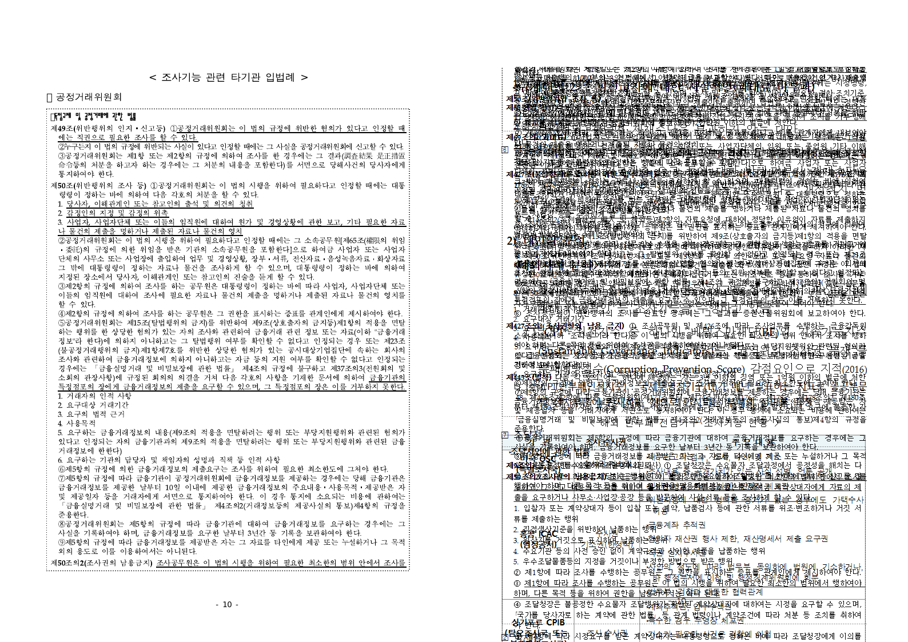

# Task #3820 Stage 17 — Windows upstream/devel PDF 직접 재현

## 목적

Stage 16에서 분리한 macOS 폰트 fallback 가능성을 제거하기 위해, Windows 한컴 계열
시스템 폰트가 있는 호스트에서 `upstream/devel`을 기준 PDF와 직접 대조한다. 이 Stage는
로컬 보정 브랜치를 Windows에 전달하지 않으며, 원격 기본 작업 트리의 clean한
`upstream/devel`만 사용한다.

## 기준 및 실행 환경

- Windows 호스트: `win10-ted`, PowerShell
- 작업 트리: `C:\Users\admin\Desktop\rhwp\rhwp`
- 검증 commit: `955910136` (`upstream/devel`)
- HWP: `samples/basic/issue2007_nested_cell_pagination_42065.hwp`
- 기준 PDF: `pdf/basic/issue2007_nested_cell_pagination_42065-2020.pdf`
- 기준 PDF: 17쪽, A4
- rhwp build: `CARGO_TARGET_DIR=C:\Users\admin\Desktop\rhwp\target\verify-upstream-devel-issue2007`,
  `CARGO_INCREMENTAL=0`, `cargo build --release --bin rhwp`
- 출력: `rhwp export-svg <HWP> -p 9..16 -o <외부 검증 경로> --profile print --json`
- raster: Windows Edge headless로 p10 SVG를 794×1123 PNG로 변환하고, 같은 실행에서
  Poppler 96dpi로 새 rasterize한 PDF p10과 나란히 대조했다.

## 결과

`rhwp info --json`은 이 HWP를 24쪽으로 보고했으며, 기준 PDF의 17쪽과 이미 다르다.
p10(0-based page 9) `export-svg --json`은 `overflowCellLines=234`와
`PartialTable` overflow 816.6px을 보고했다. 실제 Windows Edge raster에서도 본문이
중첩 표 안에서 대량 겹치고 clip된 것이 확인됐다.

따라서 이 차이는 macOS의 `휴먼명조` fallback만으로 설명할 수 없다. page count,
cell clip geometry, text overlap이 모두 PDF와 달라 현재 `upstream/devel`은
issue2007의 정답 기준을 만족하지 않는다.

## 경계와 다음 Stage

- Windows 기본 작업 트리는 검증 후에도 clean한 detached `upstream/devel`이며, 기존
  `review/kevin9327-20260726` 브랜치와 다른 Windows worktree를 수정하지 않았다.
- 이 결과는 로컬 `task/3820-3821-fidelity`의 31개 미통합 보정 commit을 평가한 것이
  아니다. 다음 구현 Stage 전에 해당 작업 브랜치를 최신 `upstream/devel`로 rebase한 뒤,
  이 기준 PDF·Windows raster 절차로 p10–p17을 다시 대조해야 한다.
- p10의 24/17쪽·overflow 재현은 남은 row-break nested table pagination 결함의
  확정 근거이며, 폰트 보정만으로 닫을 수 없다.
