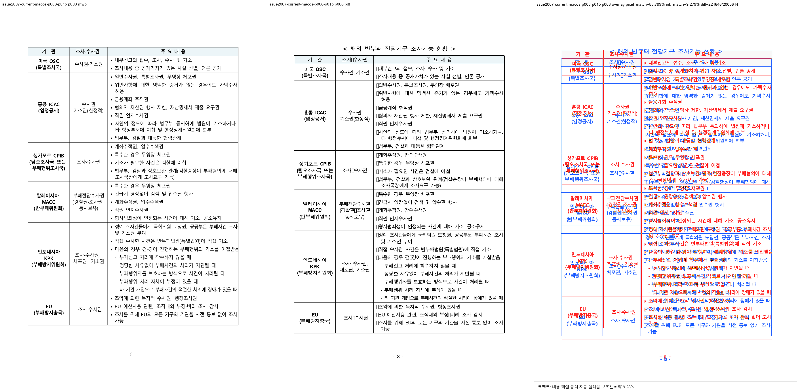

# Task #3820 Stage 18 — 현재 macOS visual sweep p8–p17 PDF 직접 대조

## 목적

이전 Windows `upstream/devel` 재현은 로컬 보정 commit을 포함하지 않았으므로 현재
브랜치의 판정 근거로 사용하지 않는다. 이 Stage는 `task/3820-3821-fidelity`의 현재
head에서, 새로 등록한 한컴 TTF가 보이는 macOS 환경으로 `issue2007` p8–p17을 기준
PDF와 다시 직접 대조한다. 앞선 96dpi 수동 pair는 같은 SVG를 사용했지만 누적 line drift를
사람이 잘못 통과로 판정했다. visual sweep의 page별 overlay·frame·line-band 원장을 권위 증적으로
삼아 그 오판을 바로잡는다. 이어 p8–p15의 실제 Canvas 화면이 제공된 뒤, 이른 페이지의
heading owner 이동을 누락했음이 확인되어 p8–p15 sweep을 추가했다.

## 기준 및 실행

- 검증 commit: `b79704fb6` (`task/3820-3821-fidelity`; Stage 18 증적 commit 직전 head)
- HWP: `samples/basic/issue2007_nested_cell_pagination_42065.hwp`
- 기준 PDF: `pdf/basic/issue2007_nested_cell_pagination_42065-2020.pdf`
- `rhwp info --json`: HWP 17쪽. 기준 PDF와 같은 17쪽이다.
- build: `CARGO_TARGET_DIR=target/task-3820-3821-fidelity`,
  `CARGO_INCREMENTAL=0`, `cargo build --release --bin rhwp`
- visual sweep: `scripts/visual_sweep.py --rhwp-bin <현재 release CLI> --pages 8-15 --dpi 144` 및
  `--pages 10-17 --dpi 144`. 스크립트가 기본 `export-svg`와 render tree를 문서 전체에 대해 새로 만들고, 선택한
  144dpi `rsvg-convert` SVG와 Poppler PDF raster로 대조했다.
- 현재 default SVG와 PDF는 각각 17쪽이다. p8–p17의 compare·overlay·review가 모두 생성됐다.

현재 fontconfig는 `휴먼명조`(`HMKMM.TTF`), `휴먼고딕`(`HMKMG.TTF`), `맑은 고딕`,
`HY견명조`(`HYMJRE.TTF`), `HY견고딕`을 실제 파일로 해석한다. 반면 HWP가 요청하는
`굴림`·`바탕`·`한양신명조`·`한양중고딕` 등의 논리 family는 이 호스트에서 아직 Verdana로
fallback된다. 그러나 이번 결과는 그 사실만으로 설명할 수 없다. frame 시작 좌표·본문 line band·
목록 marker가 함께 달라져, 폰트 비교가 아닌 layout fidelity 결함으로 판정한다.

## 페이지별 결과

| 페이지 | PDF 기준과의 visual sweep 대조 | 판정 |
| --- | --- | --- |
| 8 | PDF는 `<해외 반부패 전담기구 조사기능 현황>` heading 뒤 표가 시작하지만 rhwp에는 heading이 없고 표가 곧바로 시작한다. frame top도 37px 위다. | heading owner/flow 불일치 |
| 9 | PDF는 `<국내 유사입법례 분석>` heading부터 시작하지만 rhwp는 앞 표의 continuation bullet부터 시작한다. frame top 43px 위, line band 평균 drift 41.9px. | page owner/flow 불일치 |
| 10 | rhwp frame top `270px`, PDF `347px`(77px 위). line band 54/49, 평균 y drift 70.9px. | frame/flow 불일치 |
| 11 | 우측 column의 평균 y drift 120.8px, 다음 `국세청` block의 시작과 continuation flow가 PDF와 다르다. | flow 불일치 |
| 12 | rhwp frame `(126,236,1078,1645)`, PDF `(39,113,1151,1645)`로 x/y 시작과 폭이 모두 다르다. | frame/flow 불일치 |
| 13 | frame top이 PDF보다 21px 아래이며, 빈 사각 marker가 `4` 순번으로 투영된다. | layout/marker 불일치 |
| 14 | rhwp frame의 x 시작이 PDF보다 87px 안쪽이고 y는 15px 아래다. marker가 `6` 순번이다. | layout/marker 불일치 |
| 15 | rhwp frame의 x 시작이 PDF보다 87px 안쪽이며 marker가 `7` 순번이다. | layout/marker 불일치 |
| 16 | frame 좌표는 같아도 content bottom이 PDF보다 11px 위다. | 세로 흐름 불일치 |
| 17 | frame 좌표는 같아도 content bottom이 PDF보다 10px 위다. `3)`·`4)`는 보이나 자동 ink 일치율은 7.96%다. | 세로 흐름 불일치 |

10쪽의 pixel match 평균은 87.83%지만, 종이 여백이 큰 비중을 차지한다. 내용 잉크만 본
자동 일치율 보조값은 평균 8.98%(최저 p17 7.96%, 최고 p12 10.12%)로 낮다. 따라서 이 수치는
페이지 수가 같거나 넓은 여백이 같다는 사실로 layout fidelity를 통과 처리할 수 없음을 뒷받침한다.

코멘트: 내용 픽셀 중심 자동 일치율 보조값 = 약 9.28%.
높을수록 좋음: 기준 PDF와 rhwp PNG가 더 비슷함
낮을수록 나쁨/검토 필요: 잉크 위치나 형태 차이가 큼
단, 사람 판정 정확도가 아니라 내용 픽셀 중심 자동 일치율 보조값입니다.

각 페이지의 비교 자료는 다음 위치에 보관한다. p8–p15의 새 run은 heading owner와
continuation 경계를 확인하기 위한 전체 산출물을 보관하며, 기존 p10–p17 run은 p16–p17까지의
연속 비교 증적이다.

- p8–p15 compare/overlay/review·수치 원장: `mydocs/pr/assets/task_m100_3820_stage18_current_macos_font_validation/visual_sweep_p008_p015/`
- p10–p17 compare/overlay/review·수치 원장: `mydocs/pr/assets/task_m100_3820_stage18_current_macos_font_validation/visual_sweep/`

## 남은 구현 범위

`--profile print` 수동 pair와 default SVG p10은 SHA-256까지 같았다. 즉 앞선 오판은 profile
차이가 아니라 96dpi 정적 side-by-side만 보고 누적 line drift를 놓친 데 있다. 현재 경로는
p8–p17을 통과하지 못했다. 우선 p8–p9에서 heading과 표 continuation이 이전 페이지에 잘못
소유되는 RowBreak cut·nested 1×1 content-origin 경로를 고친다. 그 다음 p10–p12의
table continuation·line-flow 분기, p10–p15의 빈 사각 marker→순번 변환, 전 페이지의 세로 기준선 drift를 source→IR→layout→SVG
경로로 분리한다. 이후 동일 visual sweep을 다시 실행해 모든 페이지의 review·overlay를 PDF와
판정한다.
