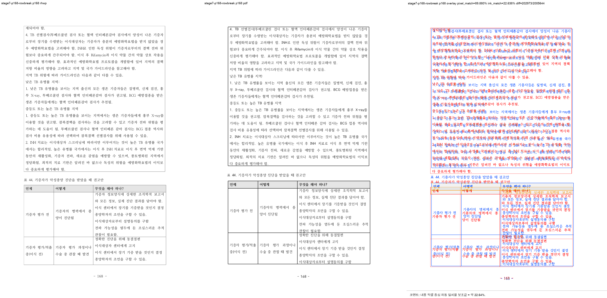
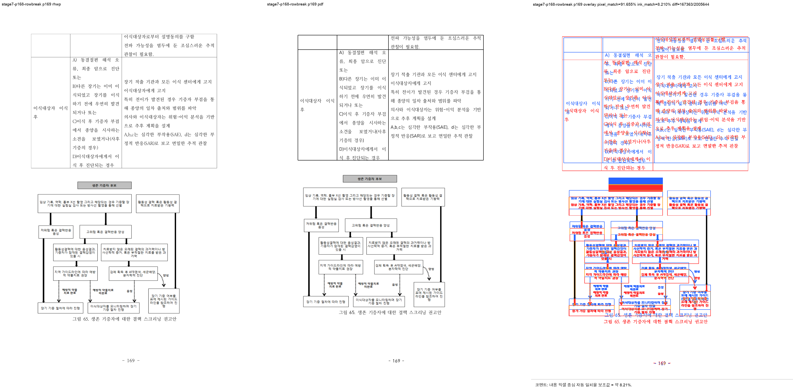
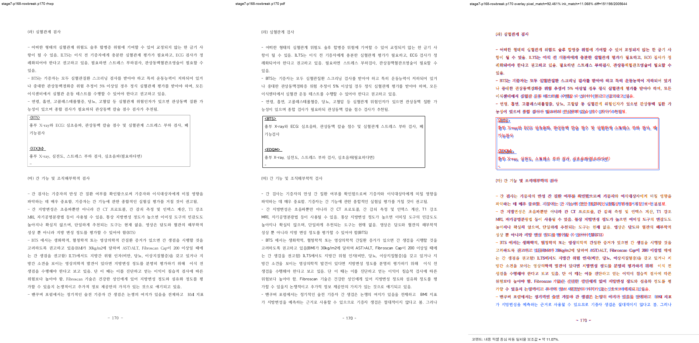

# Task #3820·#3821 Stage 7 visual sweep — p168 표 44 RowBreak 첫 fragment

## 정답지와 범위

Stage 7은 215쪽 전수 결함 종합 보고서 D-03의 최초 물리 분기만 검증한다. HWP와 HWPX는 같은
개인정보 제거 문서이며, 한컴 2020 기준 PDF가 physical-layout 정답지다.

- HWP: `samples/정책연구용역사업 중간진도보고서(살아있는 간장 기증자의 의학적 선별기준 연구).hwp`
- HWPX: `samples/정책연구용역사업 중간진도보고서(살아있는 간장 기증자의 의학적 선별기준 연구).hwpx`
- 한컴 2020 PDF: `pdf/pr3740/hwp/정책연구용역사업 중간진도보고서(살아있는 간장 기증자의 의학적 선별기준 연구)-2020.pdf`
- code revision: `319ed3dd4` (`fix: #3820 p168 RowBreak 표 첫 조각 배치`)

수정은 native HWP5·non-TAC·문단 기준 `TopAndBottom`·`RowBreak`·다행 ordinary-row·표 셀
각주 없음·다음 문단 stored-vpos rewind가 동시에 성립하고, 저장 표 하단이 body 안에 있는 경우에만
선언 높이 기반 통째 이월을 건너뛰고 fragment scan에 맡긴다. 일반 anchor tolerance나 전역 page height는
바꾸지 않았다.

## 실행과 완결성

```text
python3 scripts/visual_sweep.py \
  --key stage7-p168-rowbreak \
  --hwp 'samples/정책연구용역사업 중간진도보고서(살아있는 간장 기증자의 의학적 선별기준 연구).hwp' \
  --pdf 'pdf/pr3740/hwp/정책연구용역사업 중간진도보고서(살아있는 간장 기증자의 의학적 선별기준 연구)-2020.pdf' \
  --pages 168-170 --dpi 144 \
  --rhwp-bin target/task-3820-3821-fidelity/release-test/rhwp \
  --out output/task-3820-3821-fidelity/stage7-p168-rowbreak
```

`run_state=complete`, requested/completed/missing은 **3/3/0**이고, selected raster·compare·overlay·review
PNG도 각각 3개다. 수정 후 rhwp 전체 SVG/render tree는 218쪽이며, 수정 전 219쪽에서 표 44를 통째로
이월해 생기던 그림 65 전용 p170 한 쪽이 제거됐다. 이는 기준 PDF 215쪽과 아직 3쪽 차이므로 전체
page-map 정합 또는 D-03 전체 해소를 주장하지 않는다.

## 직접 판정

| 사용자 쪽 | 수정 전 | 수정 후 dump/render tree | 한컴 2020 PDF 대조 판정 |
| --- | --- | --- | --- |
| p168 | 표 44 `pi=1778`이 전혀 없어 하단 공백 | `PartialTable rows=0..3`, `endCut=[2,2,4]` | 표 header·첫 fragment가 caption 뒤에서 시작 — **일치** |
| p169 | `pi=1778` 전체 header 반복, 그림 65 없음 | `PartialTable rows=2..4`, `startCut=[2,2,4]` 뒤 그림 65 `pi=1780` | table continuation과 그림 65가 한 쪽에 공존 — **일치** |
| p170 | 그림 65 전용 쪽 | 첫 body item `pi=1784`, `(라) 심혈관계 검사` | 기준 PDF와 같은 logical body 시작 — **일치** |

visual sweep은 p168~170에 자동 flag 0건을 기록했다. 이 수치는 font raster/anti-aliasing 차이와 layout
fidelity를 구분하지 못하므로 성공 근거를 대체하지 않는다. 위 `PartialTable` owner 경계, page text 회귀,
그리고 아래 3-way PNG의 사람 대조를 함께 사용했다.







## focused 회귀

```text
CARGO_TARGET_DIR=target/task-3820-3821-fidelity CARGO_INCREMENTAL=0 \
  cargo test --profile release-test --test issue_3738_rowbreak_table_footnote_fragment
# 19 passed; 0 failed
```

새 회귀 `native_hwp5_rowbreak_table_starts_its_first_fragment_on_p168`은 p168의 표 첫 fragment,
p169의 continuation+그림 65, p170의 심혈관계 검사 시작을 source text와 render tree 양쪽에서 고정한다.
기존 같은 HWP fixture의 p26·p30·p43·p52·p66·p76·p78·p90·p127·p154~158 회귀도 함께 통과했다.
사용자가 이미 수동으로 확인한 WASM build는 재실행하지 않았다.

기존 일부 regression의 `page_count()==219`는 p168 이후에 존재하던 known extra page를 고정하던 전역
불변량이어서, 해당 early-page 계약은 그대로 검증하면서 `page_count() <= 219`로 바꿨다. 새 focused
회귀가 p168~170의 정확한 owner/page contract를 직접 고정하므로, unrelated page 증가도 계속 실패한다.

```text
python3 scripts/check_markdown_links.py \
  mydocs/working/task_m100_3820_stage7.md \
  mydocs/working/task_m100_3820_stage7_visual_sweep.md \
  mydocs/report/task_m100_3820_report.md
# 검사 문서 3개, 내부 Markdown 상대 링크 이상 없음
```

전역 `check_document_metadata.py`는 이 Stage 문서가 아닌 기존 `mydocs/tech/` 문서 3개의 metadata
오류(`envelope_provenance.md`, `task_m100_3604_password_encryption_cpp_review.md`)를 보고했다. 이
renderer 보정과 무관한 기존 문서 결함이라 이번 Stage의 범위에는 섞지 않았다.

## 증적·provenance

PNG/JSON을 추가하기 전에 `git check-attr`와 `git lfs track`으로 경로를 판정했다. 모두
`filter/diff/merge=unspecified`이고 LFS tracked pattern에 맞지 않아 일반 Git 증적으로 보관했다.
원본 HWP/HWPX/PDF는 위 canonical 경로에 이미 보관돼 있어 중복 복사하지 않았다.

- [run manifest](../pr/assets/task_3820_stage7_p168_rowbreak/run_manifest.json), [sweep summary](../pr/assets/task_3820_stage7_p168_rowbreak/summary.json), [구조 지표](../pr/assets/task_3820_stage7_p168_rowbreak/metrics.json), [overlay 지표](../pr/assets/task_3820_stage7_p168_rowbreak/overlay_metrics.json), [contact sheet](../pr/assets/task_3820_stage7_p168_rowbreak/review_contact_sheet.png)
- HWP SHA-256: `50094a3db2b2003b293c5cbf43014d001aa97929acb488cef0cb7ea0e16b3113`
- HWPX SHA-256: `8ae9dc95643d0902fcced2af73badd732aea86c1cc5b875ef7b1272bccba862c`
- PDF SHA-256: `7879ffee6313575132187c44c0090cd2e62c32c12c29b7eabd989181acf27b3a`
- rhwp binary SHA-256: `da48a442d419da990a68e1dfef9b2bc4dce92a6a70621670e4701235349ee08f`
- review PNG SHA-256: p168 `08af54253d8b636c5aa84b842fba22819ca800b0ef6c156b6472f2b8239544eb`, p169 `de467d3ad844b46848c4b6d43570a8c806439904e22d2996312f8442adf79d5c`, p170 `d7bf883a28e7e8534f90f9635febb3ee5229d65ca32df4569308ce87b139a2f7`
- run manifest SHA-256: `385ffaff3a5e745ec697a02d82b1c3d8ce99eb96308e1ef3fdf543072721c8a3`

## 이월

이 Stage는 D-03의 p168 최초 분기만 해소했다. 기준 PDF보다 남은 3쪽과 전수 report의 D-01
(p118→119 TopAndBottom 그림 앞 문단 owner), D-02(p127 PDF 대비 wrap 관계 false negative), 그리고
독립 visual candidate는 별도 분석 stage에서 다시 정답지와 대조한다.
