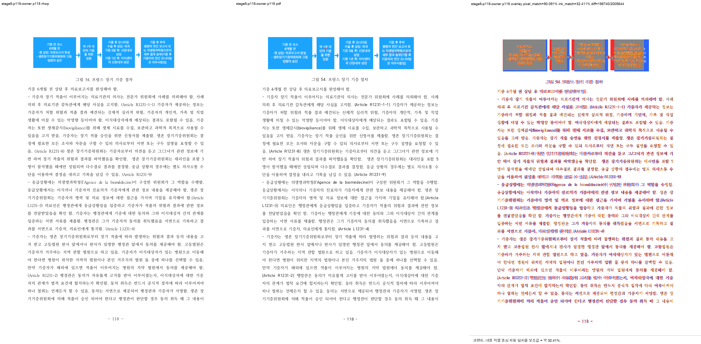
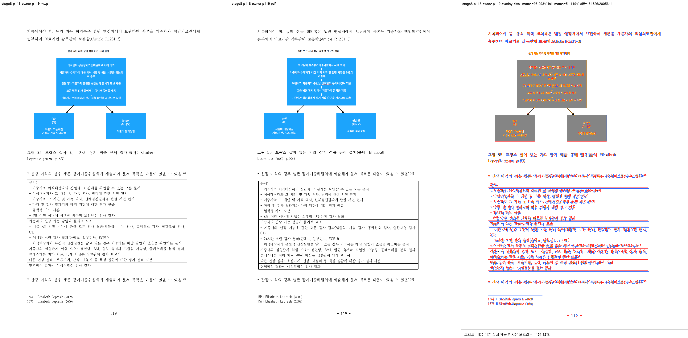

# Task #3820 Stage 8 visual sweep — p118→p119 그림 55 앞 본문 owner

## 정답지와 실행

Stage 8은 #3820의 그림 55(`pi=1276`) 앞 본문 `pi=1275`의 내부 reset을 PDF physical-page
owner와 대조한다. 입력 HWP와 한컴 2020 기준 PDF는 [Stage 8 분석](task_m100_3820_stage8.md)과
같다.

```text
python3 scripts/visual_sweep.py \
  --key stage8-p118-owner \
  --hwp 'samples/정책연구용역사업 중간진도보고서(살아있는 간장 기증자의 의학적 선별기준 연구).hwp' \
  --pdf 'pdf/pr3740/hwp/정책연구용역사업 중간진도보고서(살아있는 간장 기증자의 의학적 선별기준 연구)-2020.pdf' \
  --pages 118-119,127 --dpi 144 \
  --rhwp-bin target/task-3820-3821-fidelity/release-test/rhwp \
  --out output/task-3820-3821-fidelity/stage8-p118-owner
```

run state는 `complete`, requested/completed/missing은 **3/3/0**이다. 최신 renderer는 전체
SVG/render tree 218쪽을 export했으며, 이 stage는 전체 215쪽 page-count 차이를 해결했다고 주장하지
않는다.

## 직접 판정

| 사용자 쪽 | 수정 전 | 수정 후 | 한컴 2020 PDF 대조 |
| --- | --- | --- | --- |
| p118 | `pi=1275` 11줄이 모두 owner | lines `0..8`만 배치 | 본문 tail 경계 일치 |
| p119 | 그림 55로 즉시 시작 | `pi=1275` lines `9..10` 뒤 그림 55 | 본문 tail·그림 순서 일치 |
| p127 | Square 그림 옆 본문 여백이 PDF보다 큼 | 변경 없음 | **잔여 결함**, 후속 stage 대상 |

자동 visual flag는 p118/p119에 0건이다. p127도 현재 구조/overlay heuristic flag가 0건이지만
사람의 PDF 직접 대조로 이미 확인된 false negative이므로 해결로 취급하지 않는다.





## 회귀와 provenance

```text
CARGO_TARGET_DIR=target/task-3820-3821-fidelity CARGO_INCREMENTAL=0 \
  cargo test --profile release-test --test issue_3738_rowbreak_table_footnote_fragment
# 20 passed; 0 failed
```

PNG/JSON 생성 전 `git check-attr -a`와 `git lfs track`을 확인했다. 증적 경로는 LFS pattern
`pdf-large/**/*.pdf`에 해당하지 않고 attribute도 unspecified이므로 일반 Git으로 보관한다. 원본 HWP,
HWPX, 기준 PDF는 canonical sample/PDF 경로에 이미 보관돼 있어 복제하지 않는다.

- [run summary](../pr/assets/task_3820_stage8_p118_owner/summary.json), [run manifest](../pr/assets/task_3820_stage8_p118_owner/run_manifest.json), [구조 지표](../pr/assets/task_3820_stage8_p118_owner/metrics.json), [overlay 지표](../pr/assets/task_3820_stage8_p118_owner/overlay_metrics.json), [contact sheet](../pr/assets/task_3820_stage8_p118_owner/review_contact_sheet.png)
- renderer SHA-256: `e3eba0abf2c7212dbe4bc3ceda97204134b10fef9cee3992f4a920b14131bc8c`
- review SHA-256: p118 `f892d539ad07ce25cbb48b227fd9e3f75f0d0e2ff8a094600f0d2b7b798bc4f0`, p119 `cd956384a143b7234ce43e1d1cf30c2fff6ae447df687ab690eac8ddd486e39e`

## 이월

#3821 p156 Square 그림은 앞 stage에서 수정·회귀 검증을 마쳤다. #3820의 p118→p119 owner는 이
stage에서 해소했다. 다만 #3820 p127의 Square-wrap PDF 여백 차이와 기준 PDF 대비 전체 page-count
차이는 남아 있으므로, 다음 stage에서는 p127의 render geometry를 기준 PDF와 수치로 대조해 별도
보정을 검토한다.
