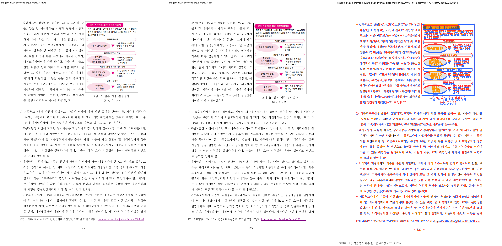
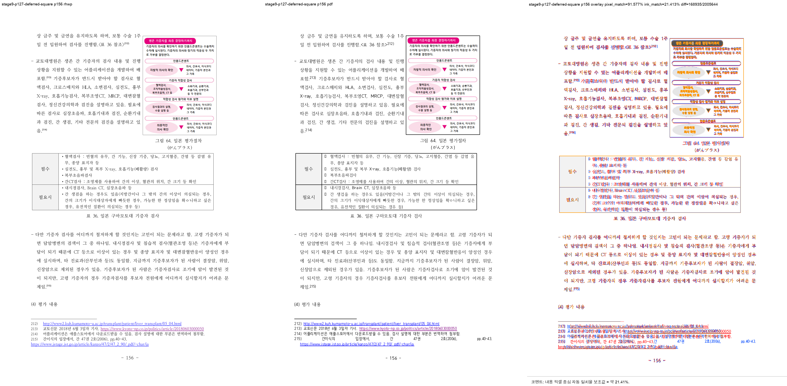

# Task #3820 Stage 9 visual sweep — p127 deferred Square 그림 56 page-top

## 정답지와 실행

입력 HWP와 한컴 2020 기준 PDF는 [Stage 9 분석](task_m100_3820_stage9.md)의 canonical 경로를
사용했다. 원본 HWP/HWPX와 기준 PDF는 이미 `samples/`와 `pdf/pr3740/hwp/` 아래에 보관되어 있으므로
이번 증적에는 중복 복사하지 않았다.

```text
python3 scripts/visual_sweep.py \
  --key stage9-p127-deferred-square \
  --hwp 'samples/정책연구용역사업 중간진도보고서(살아있는 간장 기증자의 의학적 선별기준 연구).hwp' \
  --pdf 'pdf/pr3740/hwp/정책연구용역사업 중간진도보고서(살아있는 간장 기증자의 의학적 선별기준 연구)-2020.pdf' \
  --pages 126-127,156 --dpi 144 \
  --rhwp-bin target/task-3820-3821-fidelity/release-test/rhwp \
  --out output/task-3820-3821-fidelity/stage9-p127-deferred-square
```

run state는 `complete`, requested/completed/missing은 **3/3/0**, structural visual flag는 **0건**이다.
전체 SVG/render tree export는 218쪽이며, 이 선택 검증은 전체 215쪽 page-count 차이를 해소했다고
주장하지 않는다.

## 직접 판정

| 사용자 쪽 | 계약 | PDF 직접 대조 결과 |
| --- | --- | --- |
| p126 | 그림 56은 다음 physical page owner | 그림 56 미출력, 정상 |
| p127 | `pi=1355/ci=0` frame top = body top `83.2px`; `pi=1356` narrow band 유지 | 그림과 본문 시작점·side-wrap 관계가 기준 PDF와 일치 |
| p156 | full-width tail 뒤 Square 그림 64의 별도 offset contract 유지 | 기존 PDF 배치 유지, p127 보정의 회귀 없음 |





## 자동 후보화 회귀와 provenance

수정 전 p127처럼 column 첫 Square image가 body top보다 20px 이상 아래에 있고 같은 top에 side-wrap
본문이 있는 geometry는 `deferred_square_picture_top_drift` 후보가 된다. 이 규칙은
`fidelity_compare` layout ledger와 visual sweep이 공통 사용하며, 합성 render-tree 및 sweep bridge의
Python 회귀로 검증했다. 수정된 실제 p127은 frame top이 body top과 같으므로 후보가 없는 것이 올바른
결과다.

PNG/JSON 생성 전 `git check-attr -a`와 `git lfs track`을 확인했다. 저장 증적은 LFS pattern
`pdf-large/**/*.pdf`에 해당하지 않고 attribute도 unspecified이므로 일반 Git으로 보관한다.

- [run summary](../pr/assets/task_3820_stage9_p127_deferred_square/summary.json), [run manifest](../pr/assets/task_3820_stage9_p127_deferred_square/run_manifest.json), [구조 지표](../pr/assets/task_3820_stage9_p127_deferred_square/metrics.json), [p127 geometry](../pr/assets/task_3820_stage9_p127_deferred_square/render_tree_127.json), [p127 분석](../pr/assets/task_3820_stage9_p127_deferred_square/page_127.json), [overlay 지표](../pr/assets/task_3820_stage9_p127_deferred_square/overlay_metrics.json), [contact sheet](../pr/assets/task_3820_stage9_p127_deferred_square/review_contact_sheet.png)
- renderer SHA-256: `fc19d178f1af178982454dc95681af6ac02fe0b32ab0f8a16cf692b4ef9dad62`
- review SHA-256: p127 `c20060f58b9c33b53203761a29680939504b2e6b948eb29677f86d265de936b1`, p156 `0a6d075a246185a2a4efb38de6c541347f6da7e7a7d02d756726bc24779dc097`

## 이월

#3821의 p156 Square 그림은 이 회귀로 재확인했다. #3820 p127 geometry와 자동 후보화는 이 stage에서
해소했다. 다만 p168 이후 D-03 연쇄 pagination divergence와 전체 218/215 page-count 차이는 남아 있어
다음 stage에서 최신 renderer 기준으로 최초 남은 분기를 다시 확정한다.
